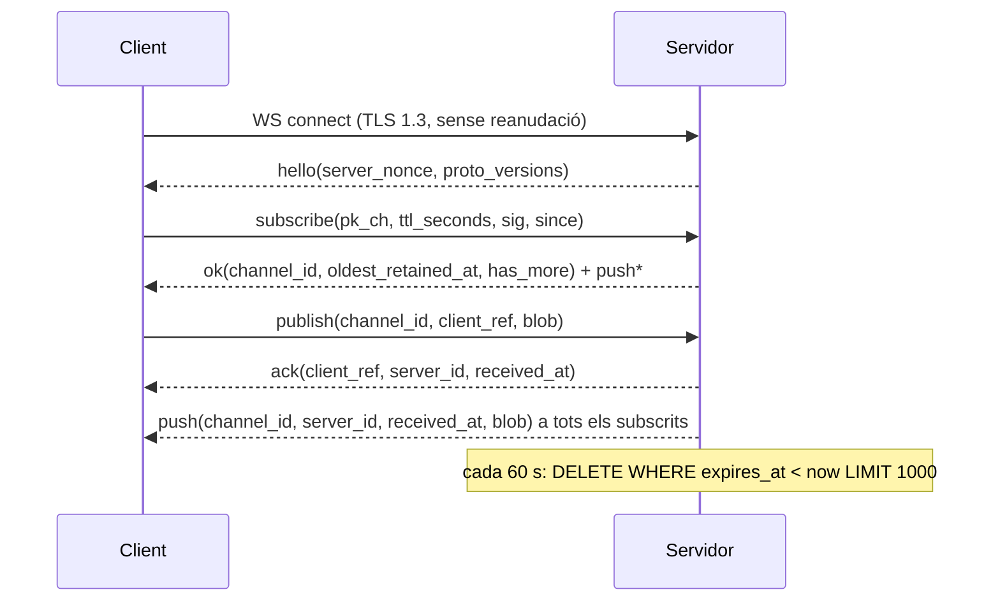
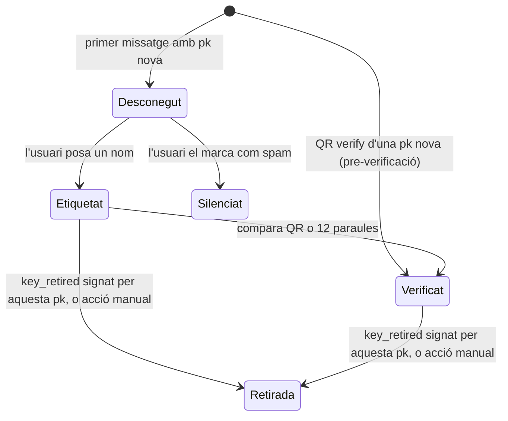
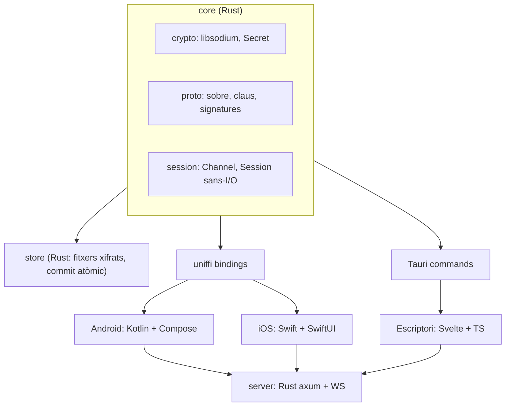
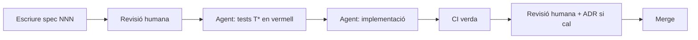

# Xat privat E2E — Especificació i pla (SDD)

Versió: mvp · Actualitzat: 2026-09-20 · Marc Vilardebó · Revisió post-auditoria C (vegeu §13)

Aquest fitxer és la font canònica de l'especificació (vegeu §11 "Governança"). Còpia de lectura, pot anar endarrerida: https://claude.ai/code/artifact/1527bf13-79e8-485a-908d-a515cbd062a4

## 1. Visió i objectius

Un xat de grup xifrat punt a punt on el servidor és només una bústia: no té comptes, no coneix identitats i no pot llegir res. L'accés a un canal es dona compartint una config fora de banda (QR en persona, fitxer xifrat amb contrasenya). Clients d'escriptori, Android i iOS sobre un mateix nucli criptogràfic en Rust. Codi obert: qualsevol pot desplegar el servidor, i cada canal viu al servidor que va triar qui el va crear (ADR 0022). Tres paraules: xat, privat i simple. Cada peça que no aporti una garantia demostrable és un lloc on fallar, i no hi és.

**El que promet**

- Ni el servidor ni ningú a la xarxa pot desxifrar els missatges.
- Els missatges caducats s'esborren al servidor i al client segons el TTL del canal.
- Cada missatge està autenticat: el receptor sap que ve de la mateixa clau que ja havia etiquetat.
- Cap identitat global: la clau d'un usuari és diferent a cada canal.
- El servidor no sap qui escriu: veu blobs opacs per canal, no per membre.

**El que no promet (i s'ha de dir clarament a la documentació)**

- No protegeix contra un dispositiu compromès ni contra un membre que reenviï.
- La confidencialitat de tot el canal depèn de `K_ch`: qui la tingui pot desxifrar qualsevol missatge del canal que hagi capturat, passat o futur, fins que es creï un canal nou. La v1 no té *forward secrecy* ni *post-compromise security* criptogràfiques (ADR 0013, 0004).
- Els missatges són autenticats però no negables.
- El servidor pot esborrar o retardar missatges; el client ho detecta parcialment (buits de comptador) però no ho pot impedir.
- Qui operi, allotgi o requisi el servidor sap des de quina IP i a quina hora escolta cadascú, i quan obres l'app. Sense Tor, una IP és una persona.
- Per defecte els canals nous van al servidor configurat a l'app, que a la instal·lació és el del projecte; qui no vulgui que aquest operador vegi les seves metadades el canvia a la configuració o en crear el canal.
- La botiga d'apps i el sistema operatiu saben que tens l'app instal·lada i quan la fas servir; altres apps poden detectar-la.
- A escriptori, dins la sessió de l'usuari qualsevol procés seu pot llegir els fitxers de dades i el keychain.

**Fora d'abast de la v1:** trucades, fitxers adjunts, citació de missatges, indicadors de presència, missatges 1-a-1 amb prekeys, expulsió de membres, exportació d'identitat entre dispositius, servidor federat, notificacions push, client web allotjat (ADR 0017), codi de coacció.

## 2. Model d'amenaces

L'adversari principal és el servidor (o qui el comprometi, l'allotgi o el requisi) i qualsevol observador de la xarxa. El dispositiu de l'usuari i els altres membres es consideren de confiança dins d'un canal pel que fa al contingut. La taula següent es reprodueix literalment a `docs/threat-model.md`; en cas de divergència mana aquest fitxer i el lint documental (spec 003) ho comprova.

| Adversari | Què pot veure o fer | Com ho mitiguem |
| --- | --- | --- |
| Servidor honest-però-curiós | Quins `channel_id` s'escolten, des de quina IP, quan (cada connexió = l'usuari mira l'app), classe de mida (múltiples de 1 KiB) i freqüència dels blobs, política de retenció del canal, plataforma per empremta TLS | AEAD, padding a cubells de 1 KiB, capçalera xifrada (no veu qui escriu ni quant, ADR 0018), autenticació per clau de canal (no d'usuari), sense comptes, cap registre d'IP, `since` arrodonit, sense reanudació TLS, suport de proxy SOCKS5 / Tor / servei .onion |
| Servidor maliciós | A més: retenir blobs més enllà del TTL, esborrar o retardar blobs selectivament, ocultar oients, omplir el canal | TTL també al client, buits de comptador visibles al client, codi obert + builds reproduïbles, cap client amb codi servit pel servidor (ADR 0017) |
| Operador requisat o coaccionat (ordre de conservació o intercepció) | Activar el registre IP↔canal↔hora a partir de l'ordre | No mitigable pel protocol: el servidor no guarda IP a disc per disseny però pot ser obligat a fer-ho. Tor o servei .onion; autoallotjament |
| Proveïdor de hosting o xarxa del servidor | Netflow: IP↔servidor↔hora de tots els clients; mida del grup connectat pel ventall de `push` | Tor o servei .onion. Res més a la v1 |
| Observador de xarxa de l'usuari (ISP, wifi) | DNS/SNI del servidor, hora de cada connexió, mida i direcció de cada missatge (classe d'1 KiB; escriure vs llegir). No veu quin canal ni quin membre | TLS 1.3, una sola connexió (no revela el nombre de canals), Tor opcional. A la v1 no es rota `channel_id` ni s'afegeix tràfic de cobertura |
| Membre que opera el servidor autoallotjat | Tot el del servidor + tot el del membre: etiqueta↔IP↔hora de cada company | Es documenta: en autoallotjar, l'operador veu les IP dels membres. Tor si això importa |
| Atacant sense config | Crear canals i omplir el servidor de blobs | `publish` lligat a una subscripció autenticada a la mateixa connexió; quotes per connexió, per canal i globals; límits per IP només abans d'autenticar |
| Intrús amb la config filtrada (també un ex-membre, per sempre) | Llegir tot el canal (passat i futur); escriure com a clau nova; crear claus infinites; omplir el canal fins al TTL; reinjectar blobs antics a membres que no els van veure | Es detecta si escriu (apareix com a desconegut); límit de peers desconeguts amb evicció; la quota per canal protegeix el servidor, no el canal: l'única resposta és canal nou (ADR 0008). La lectura passiva no es pot evitar |
| Intrús amb la clau privada d'un membre | Suplantar-lo dins d'aquell canal; silenciar-lo | Retirada de clau (ADR 0016); alerta a la víctima quan es rep un missatge vàlid de la seva pròpia clau; regeneració de clau; canal nou |
| Replay d'un missatge capturat | Reinjectar un missatge antic | Comptador estrictament creixent per emissor (ADR 0019): tot comptador ja vist es rebutja; `channel_id` dins l'AAD i la signatura |
| Observador físic (càmera, espectador, Google Lens) | Capturar el QR d'invitació | QR efímer en pantalla amb captures bloquejades i «escaneja només amb aquesta app»; alternativa fitxer + contrasenya dita en veu; el QR de verificació no és secret |
| Furt del dispositiu bloquejat | Fitxers locals xifrats | `K_db` embolcallada al Keystore / Secure Enclave amb credencial del dispositiu; fitxers tancats i clau zeroïtzada en bloquejar |
| Coacció física | Requisa del dispositiu desbloquejat | Només limitació de danys: bloqueig immediat en apagar pantalla, PIN de dispositiu recomanat sobre biometria. Sense codi de coacció a la v1 |
| Anàlisi forense del dispositiu després d'esborrar | Recuperar versions antigues dels fitxers (snapshots del sistema de fitxers, còpies, flash) | La garantia criptogràfica cobreix tots els fitxers (`K_db` al Keystore/SE); l'esborrat d'un missatge dins del log és físic (compactació) i no resisteix còpies antigues. Es documenta |
| Membre deshonest | Reenviar, fer captures, demostrar autoria via signatures; conèixer hàbits horaris i estil dels altres | No mitigable. Es documenta |

**Fora del model:** malware al dispositiu, dispositiu rootejat o amb jailbreak, serveis d'accessibilitat maliciosos, atacs a la cadena de subministrament de les botigues d'apps, criptoanàlisi de les primitives, disponibilitat garantida del servidor.

## 3. Decisions de disseny (ADR)

Cada fila correspon al fitxer `docs/adr/NNNN-*.md`; el títol és literal. L'índex complet, amb estat i substitucions, és a `docs/adr/README.md`.

| # | Títol | Estat | Motiu en una línia |
| --- | --- | --- | --- |
| 0001 | Clau de canal precompartida fora de banda | acceptada | El servidor no ha de saber res dels membres; no cal acordar claus en línia |
| 0002 | Un sol AEAD (XChaCha20-Poly1305) via libsodium | acceptada | La cascada no afegeix seguretat i multiplica errors |
| 0003 | Ratchet simètric de hash sobre la clau de canal | substituïda per 0013 | No donava forward secrecy: l'arrel es recomputa des de `K_ch` |
| 0004 | Sense post-compromise security a la v1 | acceptada | Complexitat alta; compromís = canal nou. FS i PCS arriben juntes a la v2 |
| 0005 | Signatures Ed25519 per missatge, amb clau per usuari i per canal | acceptada | L'única font d'autenticitat d'origen: l'AEAD sol només prova «algú amb la config» |
| 0006 | TOFU: cap llista de membres a la config | acceptada | Un intrús que escriu es fa visible; canvi de dispositiu sense reeditar la config |
| 0007 | Regeneració de clau lliure i sense enllaç amb l'antiga | acceptada | Simplicitat i privacitat; la re-verificació es mitiga amb UI |
| 0008 | Sense expulsió de membres: es crea un canal nou | acceptada | Coherent amb 0001 i 0004 |
| 0009 | TTL definit a la config, aplicat al servidor i al client | acceptada | El servidor no és de confiança per esborrar |
| 0010 | Autenticació al servidor amb un parell Ed25519 de canal | acceptada | Credencial no reutilitzable, estat zero al servidor |
| 0011 | Alarma de compromís | obsoleta | Retirada a la revisió C: text normal + `key_retired` ho cobreixen amb menys superfície |
| 0012 | Nucli criptogràfic i de protocol en Rust, compartit per tots els clients | acceptada | Una sola implementació auditable |
| 0013 | Clau de missatge derivada directament del comptador | acceptada | Substitueix 0003: O(1), sense estat de cadena, sense falsa promesa de FS |
| 0014 | TTL lligat al `channel_id` i caducitat per missatge | acceptada | Ningú pot canviar el TTL d'un canal existent; el servidor no guarda cap taula de canals |
| 0015 | Sobre binari de mida fixa; CBOR només al payload xifrat | acceptada | Bytes signats sense ambigüitat; vectors reproduïbles per tercers |
| 0016 | Retirada de clau amb missatge `key_retired` | acceptada | Una clau robada no pot seguir sent «Alice ✓» per sempre |
| 0017 | Sense client web allotjat a la v1; client d'escriptori natiu | acceptada | El membre més feble fixa les garanties de tot el canal |
| 0018 | Capçalera de missatge xifrada amb clau de canal | acceptada | El servidor no veu qui escriu ni quant; un XOR, zero canvis al servidor |
| 0019 | Una clau, un dispositiu: comptador estrictament creixent | acceptada | Tanca el replay contra receptors sense estat; elimina finestra, bitmap i exportació d'identitat |
| 0020 | Store i sessió sans-I/O al nucli Rust | acceptada | La transacció missatge + comptador + cursor existeix un sol cop, no tres |
| 0021 | Client sense base de dades: fitxers xifrats amb commit atòmic | acceptada | Zero C fora de libsodium; l'atomicitat surt del `rename`; tot fuzzejable des de Rust |
| 0022 | Servidor d'intercanvi per canal, fixat en crear-lo | acceptada | Codi obert = servidors múltiples; el grup tria el seu operador; canviar-lo és canal nou |

## 4. Model criptogràfic

Tot surt de libsodium; no s'implementa cap primitiva pròpia. Tots els paràmetres es fixen aquí, es versionen amb `proto_version` i queden congelats en acceptar la spec 013. Tot enter multi-byte al cable és big-endian. Tots els temps són unix ms en `uint64`; `ttl_ms = u64(ttl_seconds) × 1 000` i cap fórmula barreja unitats.

**Primitives**

| Ús | Primitiva libsodium | Mida i condicions |
| --- | --- | --- |
| Xifrat de missatges | `crypto_aead_xchacha20poly1305_ietf` | clau 32 B, nonce 24 B, tag 16 B |
| Xifrat de capçalera | `crypto_stream_xchacha20_xor` | clau 32 B, nonce 24 B (el mateix nonce del sobre) |
| Derivació de subclaus | `crypto_kdf_derive_from_key` (BLAKE2b) | 32 B; `ctx` de 8 bytes exactes; `subkey_id` = 0 sempre. La codificació interna de `subkey_id` és la de libsodium, no la del cable |
| Hash amb clau | `crypto_generichash` (BLAKE2b, key) | `outlen = 32` |
| Hash sense clau | `crypto_generichash` (BLAKE2b) | `outlen = 32`. `X[0..16]` vol dir «32 B i truncar als 16 primers» |
| Signatura de missatges i de canal | `crypto_sign` (Ed25519) | pk 32 B, sk 64 B, sig 64 B. Verificació amb `crypto_sign_verify_detached` de libsodium compilat **sense** `ED25519_COMPAT`: rebutja S ≥ L, `R` de petit ordre, `pk` de petit ordre i `pk` no canònica. El servidor verifica exclusivament a través de `core::crypto` |
| Contrasenya → clau (config exportada) | `crypto_pwhash` (Argon2id13) | 32 B; `OPSLIMIT_INTERACTIVE`, `MEMLIMIT_INTERACTIVE` (64 MiB), fixats per `config_version = 1` |
| Xifrat de fitxers exportats | `crypto_secretbox` | clau 32 B, nonce 24 B |
| Comparació de mides fixes | `sodium_memcmp` | Tota comparació de `[u8; N]` a `core` |
| Aleatorietat | `randombytes_buf` | — |

**Tags de domini.** Tot hash o signatura porta un prefix ASCII fix que en separa l'ús. Són literals del protocol, no del nom comercial, i es congelen amb la spec 013:

| Tag | Ús |
| --- | --- |
| `privatechat/chid/v1` | `channel_id` |
| `privatechat/auth/v1` | signatura de subscripció al servidor |
| `privatechat/msg/v1` | signatura del sobre de missatge |
| `privatechat/fp/v1` | fingerprint d'usuari |

**Contextos KDF** (8 bytes exactes, `subkey_id = 0`, congelats): `chauth__`, `msgkey__`, `chhdr___`. Canviar-ne un requereix `proto_version` nova i ADR.

**Claus**

- `K_ch` (32 B, `randombytes_buf`): clau arrel del canal. Viu només a la config i al dispositiu. No s'usa mai directament per xifrar.
- `(pk_ch, sk_ch) = crypto_sign_seed_keypair(KDF(K_ch, "chauth__"))`: parell Ed25519 **del canal**, no de cap usuari. Tots els membres el tenen. Serveix per demostrar al servidor que es té la config amb una credencial no reutilitzable (ADR 0010).
- `channel_id = BLAKE2b("privatechat/chid/v1" ‖ pk_ch ‖ BE32(ttl_seconds))[0..16]`: identificador públic del canal al servidor. Autocertificant (el servidor el recalcula a partir de `pk_ch` i `ttl_seconds`) i lliga el TTL al canal (ADR 0014).
- `K_msg = KDF(K_ch, "msgkey__")` (32 B): clau mestra de missatges del canal.
- `K_hdr = KDF(K_ch, "chhdr___")` (32 B): clau de capçalera del canal, compartida per tots els membres. Oculta al servidor qui escriu i quant (ADR 0018).
- `(pk_u, sk_u)`: parell Ed25519 de l'usuari **per canal**, generat en importar la config. `sk_u` no surt mai del dispositiu: una clau viu en un sol dispositiu (ADR 0019).

**Clau de missatge** (ADR 0013)

```
mk = crypto_generichash(outlen = 32, key = K_msg, in = pk_u ‖ BE64(counter))
```

El missatge amb `counter = c` de l'emissor *u* es xifra amb `mk` i un nonce aleatori de 24 B. Una sola derivació, O(1), sense estat; `mk` s'esborra (`Zeroize`) després de xifrar o desxifrar. Clau per missatge i nonce aleatori són dos salvavides independents: si el generador aleatori falla, salva el comptador; si el comptador es repetís, salva el nonce. Qui tingui `K_ch` pot derivar qualsevol `mk`: la v1 no té forward secrecy (§1, ADR 0004). El payload **no es comprimeix mai**, ni a la v1 ni a cap versió: comprimir abans de xifrar filtra contingut a través de la mida.

**Comptador d'enviament** (ADR 0019). Comença a 0 i és estrictament creixent per a cada `sk_u`. `Channel::encrypt` reserva `counter` i persisteix `counter + 1` juntament amb el blob a la taula `outbox` **en un sol commit abans** de derivar `mk` i retornar el blob; si el commit falla, no retorna cap blob. La UI drena `outbox` en ordre i notifica cada `ack` al nucli (`Channel::acked`). `counter = 2^64 − 1` → `Error::CounterExhausted` i la UI força «Regenerar la meva clau».

**Anti-replay** (spec 012; obligatori). Per cada `pk` vista, el receptor manté `max_counter: Option<u64>`. `c ≤ max_counter` → `Error::Replay`. `c > max_counter` → acceptar; després del desxifrat correcte, `max_counter = c`. No hi ha finestra ni bitmap: cada `sk_u` viu en un sol dispositiu i el servidor lliura cada canal en ordre total (§6). Un comptador inferior o igual al màxim vist és sempre un reenviament. `Channel::gaps()` informa de `c.saturating_sub(max_counter + 1)` per emissor com a senyal d'esborrat o retard pel servidor, amb les excepcions de §6 "Cursor i buits"; un salt superior a 2^32 es mostra com «salt de comptador anòmal: aquesta clau pot estar compromesa».

**Missatges de la pròpia clau.** El propi `pk_u` és un peer més amb `max_counter` = comptador d'enviament − 1: l'eco del servidor d'un missatge propi és `Replay` i es descarta. Si `decrypt` accepta un missatge amb `sender_pk = pk_u` propi i `counter ≥` comptador d'enviament: (1) el comptador d'enviament passa a `counter + 1` (així la víctima no queda muda); (2) es persisteix l'esdeveniment `OwnKeyUsedElsewhere`, que la UI mostra com a banner fix «Algú ha escrit amb la teva clau en aquest canal» amb l'acció «Regenerar la meva clau». Si el missatge és un `key_retired` de la pròpia `pk`, el canal queda en només lectura fins a regenerar.

**Sobre de missatge en cable** (ADR 0015, 0018; format binari fix, cap CBOR fora del payload)

| offset | mida | camp | visible pel servidor |
| --- | --- | --- | --- |
| 0 | 1 | `proto_version` = 0x01 | sí |
| 1 | 16 | `channel_id` | sí |
| 17 | 40 | `enc_hdr` = (`sender_pk` (32) ‖ `counter` u64 BE (8)) ⊕ `crypto_stream_xchacha20_xor(K_hdr, nonce)` | sí (opac) |
| 57 | 24 | `nonce` | sí |
| 81 | n | `ciphertext`, n = 16 + 1 024·k, 1 ≤ k ≤ 63 | sí (opac) |
| 81+n | 64 | `signature` | sí |

- `AAD = blob[0..81]` (inclou `enc_hdr` xifrat, tal com viatja).
- `signature = crypto_sign_detached(sk_u, "privatechat/msg/v1" ‖ blob[0..81+n])`: *encrypt-then-sign*; la signatura cobreix capçalera xifrada i ciphertext; el receptor la verifica abans de desxifrar. Una capçalera desxifrada amb una `K_hdr` incorrecta dona una `pk` aleatòria i la signatura falla.
- Mida del blob = 161 + 1 024·k: mínim 1 185 B, màxim 64 673 B. `k = (len − 161) / 1 024`.
- El servidor veu `channel_id`, la classe de mida, l'hora i la IP de la connexió. No veu qui escriu, ni quants escriuen, ni quant.

**Payload en clar** (CBOR, mapa amb claus enteres, decodificat directament a `struct Payload` amb `serde` i `recursion_limit = 8`, mai a un `Value` genèric; després `sodium_pad` a múltiples de 1 024 B; mida màxima abans del padding 64 511 B)

| clau | camp | tipus | límits |
| --- | --- | --- | --- |
| 0 | `type` | uint | 0 `text` · 1 `key_retired`. Obligatori |
| 1 | `display_name` | text | ≤ 64 B UTF-8, sense caràcters de les categories Cc i Cf; suggeriment de nom, el receptor mana. Absent a `key_retired` |
| 2 | `sent_at` | uint64 | unix ms **arrodonit cap avall al minut**; serveix només per a l'avís de retard de §6 |
| 3 | `body` | bytes | a `text`: UTF-8 vàlid; a `key_retired`: buit |

- `Payload::validate()` és l'única funció de validació i la criden `encrypt` i `decrypt`. Clau duplicada, tipus incorrecte, `type` absent o límit superat → `Error::BadPayload`.
- Després d'un AEAD correcte l'estat anti-replay **sempre** avança (autenticat = consumit). Un `type` desconegut o un error de padding, CBOR o validació persisteix el missatge com a `Unreadable` sense cos i la UI mostra «missatge no compatible o corrupte». Els camps CBOR desconeguts s'ignoren; així es poden afegir camps a la v1.x sense canviar `proto_version`.
- `key_retired` (ADR 0016): signat amb la clau que es retira. D'una `pk` desconeguda es consumeix i es descarta sense crear peer.

**Fingerprint d'usuari**: `fp = BLAKE2b("privatechat/fp/v1" ‖ channel_id ‖ pk_u)` (32 B). Es presenta de tres maneres:

- **QR de verificació**: `verify:v1:` ‖ base64url(`channel_id` ‖ `pk_u`). No porta cap nom. El receptor recalcula `fp` ell mateix.
- **12 paraules**: `fp[0..16]` codificat com a mnemònic BIP-39 estàndard (128 bits + 4 de checksum, llista anglesa de 2 048 paraules). La verificació manual només marca «verificat» si coincideixen les 12.
- **Identificador curt**: les 4 primeres paraules de les 12 (44 bits). Serveix per distingir peers a la UI, va sempre etiquetat com «identificador, no és verificació» i mai habilita l'estat verificat. Si l'identificador curt d'una `pk` nova coincideix amb el d'un peer existent, el client mostra les 12 paraules de tots dos amb l'avís «Identificador idèntic a un altre membre: possible suplantació. Verifica per QR».

**Verificació en rebre** (en aquest ordre; cada condició té un sol `Error`; qualsevol error descarta el missatge sense mostrar-lo, sense cap escriptura al Store excepte el cursor de §6):

1. `len < 1 185`, `len > 64 673` o `(len − 161) mod 1 024 ≠ 0` → `BadLength`. `blob[0] ≠ 0x01` → `UnsupportedVersion`. `blob[1..17] ≠ channel_id` → `WrongChannel`.
2. `min(received_at, now).checked_add(ttl_ms) < now` → `Expired`.
3. Desxifrar `enc_hdr` amb `K_hdr` i `nonce`: `sender_pk`, `counter`.
4. `sender_pk` retirat → `RetiredKey`. Desconegut sense lloc (§7 "Límits de peers") → `PeerLimit`.
5. `counter ≤ max_counter` → `Replay`.
6. Signatura amb `sender_pk` → `BadSignature`.
7. Derivar `mk`, desxifrar l'AEAD → `BadSignature` si falla (no pot passar amb signatura vàlida i `K_ch` correcta; es tracta igual). `sodium_unpad` → `BadPadding`. CBOR i `validate()` → `BadPayload` (missatge `Unreadable`, però consumit).
8. Persistir el missatge (o `Unreadable`), `max_counter`, el peer si és nou i el cursor **en un sol commit**; zeroïtzar `mk`.

**Regla de no-oracle.** El nucli no emet cap byte a la xarxa en funció del resultat de `decrypt`; els codis d'`Error` són només locals i cap feature futura (rebuts, «està escrivint») els pot exposar a l'emissor ni al servidor.

## 5. Config de canal i invitació

La config és l'únic secret del sistema. És un document CBOR petit que es comparteix fora de banda i que el client guarda a l'emmagatzematge local xifrat (§8).

| clau | camp | tipus | descripció |
| --- | --- | --- | --- |
| 0 | `config_version` | uint8 | 1. Ha de coincidir amb el del capçal del fitxer `PCFG`, si no `Error::BadConfig` |
| 1 | `proto_version` | uint8 | versió del protocol de missatges |
| 2 | `K_ch` | bytes32 | clau arrel del canal |
| 3 | `server_url` | text | `wss://host[:port]`; permet servidor autoallotjat i `.onion`. El tria qui crea el canal; per defecte, el `default_server_url` de la configuració de l'app. Immutable: canviar de servidor = canal nou (ADR 0008, 0022) |
| 4 | `ttl_seconds` | uint32 | caducitat dels missatges (mín. 60; màx. 2 592 000 = 30 dies). Forma part del `channel_id` |
| 5 | `created_at` | uint64 | unix ms |
| 6 | `invite_expires_at` | uint64? | unix ms; a partir d'aquí el client refusa importar-la |
| 7 | `suggested_name` | text | ≤ 64 B; nom del canal proposat; el receptor pot canviar-lo localment |

**Dues formes d'invitació, totes dues amb el mateix contingut**

| Via | Mecanisme | Quan |
| --- | --- | --- |
| QR en persona | CBOR de la config **en clar**, sense esquema d'URL: cap càmera del sistema l'obre com a URL. Les càmeres amb reconeixement al núvol (Google Lens) poden enviar la imatge a tercers: la UI diu «escaneja només amb aquesta app». `invite_expires_at` per defecte 10 min, màxim 24 h | Per defecte |
| Fitxer `.chatcfg` | Format fix: `"PCFG"` (4) ‖ `config_version` u8 ‖ `salt` 16 ‖ `nonce` 24 ‖ `crypto_secretbox(cfg_cbor)`. Clau = Argon2id13(contrasenya, salt) amb `OPSLIMIT_INTERACTIVE` i `MEMLIMIT_INTERACTIVE` fixats per `config_version = 1`; els paràmetres **no viatgen** al fitxer; versió desconeguda → refús. Es comparteix per AirDrop, Nearby, correu o missatgeria; la contrasenya es diu per un altre canal. El prefix `PCFG` identifica l'app: el fitxer es considera exposat un cop enviat, per això va xifrat | Compartir a distància |

**Contrasenya del fitxer.** La genera l'app: **7 paraules** aleatòries de la llista BIP-39 (77 bits), mostrades per dir-les per un altre canal. L'usuari no la pot triar. La longitud de la contrasenya no es redueix mai per compensar paràmetres d'Argon2id, ni al revés. El tag de `secretbox` és un oracle perfecte per a un atacant fora de línia i `K_ch` no rota: el fitxer ha de resistir anys.

**`invite_expires_at` no és un control de seguretat.** `K_ch` no caduca. La caducitat protegeix contra descuits (configs oblidades), no contra atacants: un client modificat la ignora. Qui sospiti que un QR ha estat captat ha de crear un canal nou (ADR 0008).

**Regles del client en importar**

- Refusa configs amb `invite_expires_at` passat, `config_version` o `proto_version` desconegudes, o `ttl_seconds` fora de rang.
- Deriva `channel_id`; si ja existeix localment un canal amb aquest id, no duplica. Si existeix amb `server_url` diferent → `Error::ConfigMismatch` amb error visible «config diferent per al mateix canal»: el servidor forma part del canal i no hi ha migració en calent (membres amb `server_url` diferent no es veurien).
- Genera el parell `(pk_u, sk_u)` per a aquest canal en el moment d'importar.
- No envia res al servidor fins que l'usuari obre el canal.

**Regles en exportar i mostrar**

- Exportar sempre demana confirmació i mostra un avís: qui tingui aquesta config pot llegir tot el canal, passat i futur.
- El QR de config només es mostra després d'un toc explícit, amb captures bloquejades (§8), s'amaga sol als 60 s, i la pantalla no ofereix «desar imatge» ni compartir la imatge.
- Es pot fixar `invite_expires_at` en exportar el fitxer (per defecte 24 h).

## 6. Protocol client-servidor

El servidor és una bústia amb TTL: guarda blobs opacs per `channel_id`, els reparteix per WebSocket i els esborra. No té usuaris, no valida contingut, no coneix `K_ch` ni cap altre secret, i no guarda cap taula de canals. Tota la lògica del protocol al client viu a `core::Session` (ADR 0020); la UI només obre el socket TLS i passa bytes.



**Autenticació** (ADR 0010, spec 031). En connectar, el servidor envia un `server_nonce` (32 B, `randombytes_buf`), per connexió, vàlid 60 s des del `hello`. El client respon amb `pk_ch`, `ttl_seconds` i

```
sig = crypto_sign_detached(sk_ch, "privatechat/auth/v1" ‖ server_nonce(32) ‖ channel_id(16) ‖ BE32(ttl_seconds) ‖ host)
```

on `host` és `url.host` segons WHATWG: A-label ASCII en minúscules, sense punt final, sense port, sense claudàtors; literals IP tal com apareixen a `server_url`. El servidor el compara amb la llista `hostnames` de la seva configuració, mai amb la capçalera `Host`. El servidor comprova el rang del TTL, recalcula `channel_id` a partir de `(pk_ch, ttl_seconds)`, verifica la signatura amb `core::crypto` i retorna el `channel_id` a `ok`. La credencial demostra tenir la config, no és reutilitzable per qui la vegi (servidor, proxy, logs) i el servidor no guarda res. Passats 60 s → `error{nonce_expired}` i un `hello` nou. Diversos `subscribe` dins la finestra reutilitzen el nonce (cada un lliga un `channel_id` diferent).

**Versió.** El client refusa connectar si `hello.proto_versions` no inclou exactament el `proto_version` de la config; no hi ha negociació a la baixa. Més de 8 elements → error local i desconnexió.

**Connexions.** Una connexió per **servidor**, amb fins a 16 canals subscrits per connexió; un dispositiu amb canals a N servidors té N connexions, cadascuna amb la seva `Session` (§9). Sense segon pla (§8): les connexions viuen mentre l'app és desbloquejada al primer pla; bloquejar = desconnectar. Amb un proxy SOCKS5 configurat (Tor inclòs), una connexió i un circuit per canal, aïllats per credencial SOCKS (usuari = prefix hex de 4 bytes del `channel_id`, contrasenya buida). El servidor pot enllaçar canals d'un mateix dispositiu per IP i hora; només Tor ho evita.

**Transport.** TLS 1.3 sense reanudació de sessió (cap tiquet, cap PSK; cada connexió és un handshake complet). El handshake WebSocket porta només `Host`, `Upgrade`, `Connection`, `Sec-WebSocket-Key`, `Sec-WebSocket-Version` i `User-Agent: privatechat/1`, idèntic a totes les plataformes; cap extensió WS (`permessage-deflate` desactivat). Frame màxim 70 000 B a client i servidor. L'empremta TLS de la pila de cada plataforma segueix revelant la plataforma; es documenta.

**TTL i caducitat** (ADR 0014). El TTL forma part del `channel_id` i no es pot canviar. Servidor: `expires_at = received_at + ttl_ms`. Client: `expires_local = min(received_at, now_local) + ttl_ms` segons la seva còpia de la config, sense refiar-se del servidor.

**Ordre i temps.** El servidor assigna `received_at = max(wall_clock_ms, last_received_at + 1)` per procés: únic i estrictament creixent, de manera que `ORDER BY received_at` és un ordre total. L'ordre de presentació és `received_at`; `sent_at` del payload és informatiu i el client avisa si difereix més de 5 minuts.

**Missatges del protocol** (CBOR sobre WebSocket binari; el nucli els serialitza i parseja; mapes amb claus de text)

| Missatge | Direcció | Camps |
| --- | --- | --- |
| `hello` | S→C | `server_nonce` (bytes32), `proto_versions` ([uint], ≤ 8) |
| `subscribe` | C→S | `pk_ch` (bytes32), `ttl_seconds` (uint32), `sig` (bytes64), `since` (uint64 ms, opcional; absent = tot) |
| `ok` | S→C | `channel_id` (bytes16), `oldest_retained_at` (uint64 ms), `has_more` (bool) |
| `publish` | C→S | `channel_id`, `client_ref` (bytes16, `randombytes_buf` per cada `publish`), `blob` (bytes) |
| `ack` | S→C | `client_ref`, `server_id` (bytes16), `received_at` (uint64 ms) |
| `push` | S→C | `channel_id`, `server_id`, `received_at`, `blob` |
| `error` | S→C | `code` (text), `message` (text, sense dades del client) |

Codis d'error: `bad_auth`, `nonce_expired`, `bad_ttl`, `not_subscribed`, `bad_blob`, `rate_limited`, `channel_quota`, `server_full`, `unsupported_version`.

**Cursor i buits.** `server_id` són 16 B aleatoris (únic, sense ordre, no revela volum). El client persisteix `cursor = received_at` de l'últim `push` processat, **independentment del resultat** (un blob rebutjat només escriu el cursor), al mateix commit que qualsevol altre estat d'aquell `push`. En reconnectar envia `since = cursor` **arrodonit cap avall al minut**; els duplicats resultants es descarten per `server_id` i per anti-replay. El servidor retorna `ORDER BY received_at` en pàgines de 500 amb `has_more`; `since > now` es tracta com `now`; la consulta filtra `expires_at > now`. `oldest_retained_at = now − ttl_ms`; si `since < oldest_retained_at`, el client mostra «Pot haver-hi missatges caducats abans de <data>» i `gaps()` no compta els comptadors anteriors al primer missatge rebut de cada emissor en aquesta sessió.

**Autorització i validació d'embolcall** (spec 030, 033). El servidor només accepta `publish` per a un `channel_id` autenticat amb `subscribe` a la mateixa connexió; altrament `error{not_subscribed}`. Abans de guardar un blob comprova, sense tocar res més: `1 185 ≤ len ≤ 64 673`, `(len − 161)` múltiple de 1 024, `blob[0] = 0x01` i `blob[1..17] = channel_id`; si no, `bad_blob`. No verifica signatures ni desxifra res.

**Límits i quotes** (valors de la v1, configurables al servidor):

| Àmbit | Límit | Resposta |
| --- | --- | --- |
| Connexió | 30 `publish`/min; 16 canals; 1 intent d'autenticació/s; tancament al 3r intent fallit; sense `subscribe` vàlid als 60 s del `hello` → tancament; ping cada 30 s, sense pong en 30 s → tancament; cua d'enviament ≤ 256 frames o 4 MiB, si no tancament (el client reprèn amb `since`) | `rate_limited`, tancament |
| Canal (totes les connexions) | 120 `publish`/min; 4 MiB/min; retenció màxima 64 MiB o 20 000 missatges (es rebutja el nou, no s'esborra l'antic). Comptadors en memòria, reconstruïts a l'arrencada amb `GROUP BY channel_id` | `rate_limited`, `channel_quota` |
| IP, **només connexions no autenticades** (abans del primer `subscribe` vàlid) | 20 simultànies; 60 noves/min. No s'apliquen a connexions des de `127.0.0.1` (servei .onion). La IP es manté en clar en memòria durant la connexió i no es persisteix ni es registra | tancament |
| Global | quota de disc; `SQLITE_FULL` mai és un panic | `server_full` |

La quota per canal protegeix el servidor i els altres canals, no el canal: un intrús amb la config el pot omplir en minuts i deixar-lo ple fins al TTL. El client mostra `channel_quota` com «Canal ple: probablement inundat. Crea'n un de nou» (ADR 0008). L'anti-spam dins d'un canal és client-side: silenciar desconeguts (§7).

**Emmagatzematge.** Una sola taula `messages(channel_id, server_id, received_at, expires_at, blob)` amb índexs `(channel_id, received_at)` i `(expires_at)`. SQLite pla (sense xifrar: el servidor només guarda blobs opacs; el disc va xifrat en repòs) via `rusqlite` amb `bundled`, sense `sqlx`; mode WAL, `synchronous=NORMAL`, `busy_timeout=5 s`, un sol escriptor: fil dedicat amb canal acotat (1 024 entrades) que agrupa `INSERT` en transaccions de ≤ 10 ms; cua plena → `rate_limited`. Purga: `DELETE … WHERE expires_at < now LIMIT 1 000` en bucle cada 60 s i a l'arrencada, seguit de `PRAGMA incremental_vacuum(1000)`; `PRAGMA secure_delete=ON`, `auto_vacuum=INCREMENTAL`. Els missatges són efímers per disseny: **cap còpia de seguretat de `messages`**, cap arxiu de WAL; una caiguda pot perdre missatges no lliurats i es documenta. Disc xifrat en repòs. Qualsevol snapshot del volum ha de tenir retenció ≤ 60 s o no fer-se. Postgres es reconsidera amb mètriques (§12).

**Operació** (spec 035). Configuració del servidor: `hostnames`, `trusted_proxies`, quotes, ruta de la BD. `X-Forwarded-For` només s'accepta des de `trusted_proxies`; altrament la IP del socket. Rebutja handshakes amb capçalera `Origin` (cap client de navegador a la v1). `deploy/` inclou configuracions de referència de Caddy i nginx (`access_log off`, TLS 1.3 només, sense tiquets de sessió) i un `torrc` amb `HiddenServicePort 443` per publicar el servei com a `.onion`. Cap registre de sentències SQL en producció. Als logs, cap `channel_id`, `server_id` ni IP: només comptadors agregats i codis d'error. Test de CI: cap d'aquests valors apareix a la sortida del servidor sota càrrega.

**El que el servidor sí pot fer i saber (documentat, no mitigat a la v1):**

- Metadades: quins `channel_id` s'escolten, quan (cada connexió = l'usuari mira l'app), quantes connexions, classe de mida i freqüència dels blobs, IP d'origen, plataforma per empremta TLS, i quins canals comparteixen dispositiu (mateixa connexió, o mateixa IP i hora). Només veu els canals que hi viuen: els canals del mateix usuari en altres servidors li són invisibles.
- Disponibilitat: esborrar, retardar o no repartir blobs a alguns subscriptors sense que es detecti criptogràficament. El client mostra buits de `counter` per emissor com a senyal.
- La v2 pot afegir retard aleatori i tràfic de cobertura opcional (§12).

## 7. Identitat i UX de confiança

La identitat és local i per canal: cada client manté una taula `peers(channel_id, pk, label NULL, verified, muted, retired_at NULL, first_seen, last_seen, max_counter)`. Desconegut ⇔ `label IS NULL`. El servidor no hi participa.



**Regles de presentació**

- Desconegut: nom suggerit en gris entre cometes, sense avatar, amb l'identificador curt (4 paraules). Els missatges es mostren però amb marca visible. Un desconegut no mostra mai l'etiqueta de cap altre peer ni el nom del receptor.
- Etiquetat: nom local en negre. Si dos peers del canal tenen etiquetes que col·lideixen segons la normalització de sota, ambdós porten l'identificador curt al costat.
- Verificat: nom + icona. Es perd si canvia la `pk`.
- Retirada: «Alice (clau retirada el DD/MM)», en gris. Qualsevol missatge d'aquesta `pk` rebut després de la retirada es rebutja (`Error::RetiredKey`), sigui quin sigui el seu comptador. Els registres `(pk, retired_at)` **no es purguen mai** i compten dins del límit de 500; els seus missatges sí caduquen.
- **Una etiqueta ja assignada a una `pk` del canal no es pot assignar a una altra `pk` no verificada.** Per reutilitzar-la cal verificar la `pk` nova (QR o 12 paraules) o confirmar un diàleg explícit que marca l'antiga com a retirada. La comparació d'etiquetes i de `display_name` es fa sobre `NFKC → casefold → sense espais ni caràcters de format → esquelet de confusables (UTS #39)`; en renderitzar s'eliminen els caràcters Cc i Cf.
- Si arriba una `pk` nova amb un `display_name` que col·lideix amb un peer etiquetat o verificat: avís explícit al xat («Algú diu ser X amb una clau nova. Verifica'l abans de confiar-hi»). `display_name` i l'estil d'escriptura enllacen la clau antiga i la nova per als membres; és volgut.

**Límits de peers** (spec 026). Dos comptadors per canal al receptor:

- Peers etiquetats, verificats o retirats: màxim 500 (límit dur; error visible; cap clau nova s'accepta fins que l'usuari n'esborra).
- Peers desconeguts (els silenciats hi compten): màxim 50, amb evicció LRU per `last_seen`. L'evicció esborra `max_counter` d'aquella `pk`; si torna a escriure reapareix com a desconeguda nova.
- Mai s'ignora res en silenci: la fitxa del canal mostra sempre «X claus noves ignorades» quan s'ha arribat a un límit.

**Verificació.** Pantalla amb el QR `verify:` propi i les 12 paraules. La pantalla només accepta QR `verify:v1:` amb el `channel_id` del canal obert; qualsevol altre es rebutja amb missatge. En escanejar: si la `pk` existeix → `verified = true` conservant l'etiqueta local; si no existeix → es crea el peer com a verificat amb l'etiqueta que tecleja l'usuari (**pre-verificació**: permet verificar el «mòbil nou» d'un amic abans del seu primer missatge, que és el remei real al vector de suplantació). La verificació és mútua: cadascú escaneja l'altre. Cap verificació passa pel servidor.

**Regeneració de clau** (ADR 0007, 0016, 0019). A la fitxa del canal, «Regenerar la meva clau». Flux: (1) si encara es té `sk_u`, `regenerate_identity` escriu un `key_retired` signat amb la clau antiga a `outbox` **al mateix commit** que esborra `sk_u` antiga i genera la nova; (2) la UI drena `outbox`; (3) l'usuari reapareix com a desconegut per a tothom. Avís previ: «tornaràs a aparèixer com a desconegut». Si la clau antiga s'ha perdut (mòbil perdut), la UI ho diu: «els altres seguiran veient la teva clau antiga com a vàlida; demana'ls que la marquin com a retirada», i a la fitxa de cada peer hi ha l'acció «Marcar aquesta clau com a retirada». Canviar de dispositiu = reimportar la config i regenerar: una clau viu en un sol dispositiu i no s'exporta (ADR 0019).

**Alerta de clau usada en un altre lloc.** Si el client rep un missatge vàlid de la seva pròpia `pk` que no ha enviat (§4), banner fix «Algú ha escrit amb la teva clau en aquest canal» amb l'acció «Regenerar la meva clau». És l'únic detector de compromís de clau, i és gratuït.

**Crear canal.** Formulari amb nom, TTL i servidor. El servidor ve prefixat amb el `default_server_url` de la configuració de l'app i és editable, amb la llista dels servidors ja usats en aquest dispositiu com a suggeriments; abans de crear, el client obre una connexió i comprova que el `hello` respon amb el `proto_version` esperat. La fitxa del canal mostra el servidor, no editable: cap dada bàsica del canal (`K_ch`, TTL, servidor) es pot canviar un cop creat. «Crear canal nou» prefixa el mateix nom i el mateix servidor.

**Compromís de la config.** No hi ha cap tipus de missatge per a això: qui sospiti que la config s'ha filtrat ho escriu en text i el grup crea un canal nou. La fitxa del canal ofereix sempre «Crear canal nou» (mateix nom, nova `K_ch`) i, com a text d'ajuda, recomana reinvitar només els verificats i preguntar-se d'on ha sortit la filtració (ADR 0008).

**Sortir del canal.** (1) Tanca la subscripció. (2) Esborra localment config (`K_ch`), `sk_u`, taula `peers`, `outbox`, missatges i cursor. Reimportar la mateixa config és una decisió conscient de l'usuari i no deixa cap rastre local.

## 8. Seguretat al dispositiu i al client

El dispositiu és on cauen els atacs reals; aquestes mesures són obligatòries a la v1 llevat que s'indiqui. Un sol mecanisme per plataforma; tot l'estat viu al `Store` en Rust (ADR 0020, 0021).

| Mesura | Android | iOS | Escriptori (Tauri) |
| --- | --- | --- | --- |
| Emmagatzematge local | Sense base de dades. Per canal, dos fitxers xifrats amb `crypto_secretbox` sota `K_db`: `state.bin` (estat petit, reescrit atòmicament) i `messages.log` (append-only, un registre per missatge). Crate `store` en Rust (ADR 0021); Kotlin no toca mai els fitxers | Igual; Swift no toca mai els fitxers | Igual |
| Configuració de l'app | `settings.bin` al `data_dir`, mateix format i clau `K_db` que `state.bin`: `default_server_url`, `lock_timeout`, proxy SOCKS5. A la primera obertura, `default_server_url` = la constant de compilació `DEFAULT_SERVER_URL` (el servidor del projecte; cada *fork* hi posa el seu). Cap altra URL de servidor al codi | Igual | Igual |
| Clau d'emmagatzematge `K_db` | 32 B aleatoris embolcallats amb una clau AES-GCM del Keystore: `setUserAuthenticationParameters(lock_timeout, AUTH_BIOMETRIC_STRONG \| AUTH_DEVICE_CREDENTIAL)`, `setInvalidatedByBiometricEnrollment(false)`, `setUnlockedDeviceRequired(true)`, StrongBox si n'hi ha | 32 B aleatoris embolcallats amb una clau P-256 de la Secure Enclave: `SecAccessControl(.privateKeyUsage, .userPresence)`, ítem `kSecAttrAccessibleWhenUnlockedThisDeviceOnly` | 32 B aleatoris al keychain de l'SO (Keychain amb ACL per signatura de codi, Credential Manager, Secret Service) |
| Pèrdua de la clau d'embolcall | Restauració de còpia, reinstal·lació o fallada del hardware esborren totes les dades locals; la recuperació és reimportar la config i regenerar la identitat. Es documenta a §1 i a l'ajuda. Cap fallada transitòria del Keystore regenera la clau d'embolcall | Igual | Igual |
| Bloqueig de l'app | **És el prompt del sistema** (BiometricPrompt amb `DEVICE_CREDENTIAL`) que desembolcalla la clau; cap PIN ni contrasenya propis de l'app. `lock_timeout` de l'app = timeout del Keystore; per defecte 1 min; opció «estricte» = bloqueig en canviar d'app; acció ràpida «Bloqueja ara». Es recomana a l'usuari PIN de dispositiu sobre biometria | Igual amb `LAContext` (`.userPresence`) | Contrasenya de l'app només si l'SO no té keychain; documentat |
| Cicle de vida de la clau | La clau desembolcallada viu només a Rust (`Secret<32>`) mentre l'app és desbloquejada al primer pla. Es zeroïtza, els fitxers es tanquen i la connexió es talla en: bloqueig per timeout, `onStop`, apagada de pantalla | Igual: `sceneDidEnterBackground`, `protectedDataWillBecomeUnavailable`, apagada de pantalla | Igual: bloqueig de sessió de l'SO o timeout |
| Segon pla | Cap. Bloquejat ⇔ desconnectat; en desbloquejar es reconnecta amb `since`. Cap cua en memòria | Igual | n/a |
| Exclusió de còpies de seguretat | `android:allowBackup="false"` **i** `dataExtractionRules` excloent `cloud-backup` i `device-transfer` | `isExcludedFromBackup` als fitxers; Keychain `ThisDeviceOnly` (exclou iCloud Keychain) | Fora del directori de sincronització de l'usuari; exclusió de Time Machine / File History documentada a `deploy/` |
| Bloqueig de captures | `FLAG_SECURE` a tota l'app | Difuminar en `willResignActive`; detectar `capturedDidChange` i cobrir | No possible; documentat |
| Notificacions locals | Mai contingut ni nom de canal ni de peer; text fix «Missatges nous» | Igual | Igual; a macOS el Notification Center persisteix l'hora |
| Notificacions push | Cap a la v1 (§12) | Cap | Cap |
| Telemetria | Cap SDK de tercers (crash, analytics, ads). Només els crash logs de l'SO, que l'usuari controla | Igual | Igual |
| Teclat | Camp de contrasenya del `.chatcfg` amb `textPassword`, `IME_FLAG_NO_PERSONALIZED_LEARNING` i `flagNoExtractUi`; avís únic si hi ha un teclat de tercers actiu | `secureTextEntry`; `autocorrectionType = .no` al compositor | n/a |
| Frontera FFI | La contrasenya es passa com a `ByteArray` i es zeroïtza a la banda UI després de la crida; `Config`, `Channel`, `Session` són handles opacs (uniffi `Object`); fora del nucli no es promet esborrat, es promet **no retenir** (cap cache, cap log, cap `toString`) | Igual amb `[UInt8]` | Rust a Rust; les cadenes de la UI Svelte es copien a `Uint8Array` i s'omplen de zeros |
| Esborrat | Purga de missatges caducats en obrir i en desbloquejar = compactació de `messages.log` (reescriure sense els caducats, `rename`). Sortir del canal = esborrar el directori del canal. La garantia criptogràfica cobreix tots els fitxers (`K_db` al Keystore/SE); l'esborrat d'un registre és físic i no resisteix còpies antigues (§2) | Igual | Igual |
| Porta-retalls | Copiar un missatge: `ClipDescription.EXTRA_IS_SENSITIVE`; es buida als 60 s. Els historials de porta-retalls de l'SO o del teclat no s'esborren; la config no es copia mai al porta-retalls | `UIPasteboard.setItems(_, options: [.localOnly: true, .expirationDate: +60 s])` (best-effort) | Es buida als 60 s; Win+V pot retenir-ho |
| Finestra i WebView | n/a | n/a | Títol de finestra fix = nom de l'app; WebView sense cache ni storage persistent (`data_directory` temporal) |
| Integritat del codi | Builds reproduïbles publicats amb hash; F-Droid o APK directe com a alternativa a Google Play | Builds reproduïbles; hash publicat | Builds reproduïbles; hash i signatura publicats |
| Root / jailbreak / accessibilitat | No es bloqueja (trencaria usuaris legítims); avís únic si es detecta. Producció sense `debuggable`, sense `usesCleartextTraffic`, cap component `exported` | Avís únic si es detecta jailbreak | Dins la sessió, qualsevol procés de l'usuari pot llegir keychain i fitxers; es documenta |

**Registre.** Cap log amb contingut, noms, claus, `channel_id` ni `pk` complets: només el prefix de 4 bytes hex quan cal depurar; en producció, nivell `warn` i res més. Tot material de clau viu en el tipus `Secret<N>` (sense `Clone`, sense `Default`, `Debug` manual = `[REDACTED]`, `PartialEq` via `sodium_memcmp`). Test `s010_t02_debug_is_redacted`: `format!("{:?}")` de cada tipus llistat a `SECRET_TYPES` és exactament `[REDACTED]`. Test `s010_t01_no_secrets_in_logs`: subscriptor de `tracing` en memòria a nivell TRACE, flux complet encrypt/decrypt amb claus conegudes, assert que ni hex ni base64 de `K_ch`, `sk_u`, `sk_ch`, `K_msg`, `K_hdr`, `mk` ni `channel_id` complet hi apareixen.

## 9. Arquitectura i stack tècnic

Un nucli en Rust conté tota la criptografia, el protocol, l'estat i la sessió; els tres clients són capes fines d'UI que obren un socket i pinten. Així només hi ha una implementació a auditar, i la transacció que manté coherents missatge, comptador i cursor existeix un sol cop.



| Component | Tecnologia | Motiu |
| --- | --- | --- |
| `core` | Rust estable fixat a `rust-toolchain.toml` (versió concreta a la spec 000), `libsodium-sys-stable`, `ciborium` + `serde`, `zeroize` | Una implementació, memòria controlada, sense GC que deixi claus en heap |
| `store` | Crate Rust separat: `std::fs` + `core::crypto` (secretbox). Implementa el trait `Store` de `core` amb dos fitxers per canal i commit atòmic per `rename` (ADR 0021). Cap SQLite, cap C fora de libsodium | Fora de `core` perquè fa I/O (AGENTS 10); una sola implementació per a les tres plataformes, fuzzejable des de Rust |
| Bindings mòbils | `uniffi` (macros proc; sense UDL); `Config`, `Channel`, `Session` com a `Object`, només `Received`, `Peer`, `Fingerprint`, `Gap`, `Event` com a `Record` | Genera Kotlin i Swift; els secrets no creuen la frontera per valor |
| Escriptori | Tauri 2 + Svelte 5 + TypeScript; el nucli s'hi enllaça com a crate Rust, sense wasm | Codi fixat i signat, keychain de l'SO, un build reproduïble més |
| Android | Kotlin, Jetpack Compose, minSdk 26. Sense Room ni SQLite: l'emmagatzematge és del nucli | Estàndard actual |
| iOS | Swift 5.10, SwiftUI, iOS 16+. Sense GRDB ni SQLite: l'emmagatzematge és del nucli | Estàndard actual |
| Servidor | Rust, `axum`, `tokio-tungstenite`, `rusqlite` (SQLite pla, `bundled`, WAL); verifica Ed25519 via `core::crypto` | Rendiment, un sol binari, autoallotjable amb Docker |
| Tests de protocol | Vectors de prova JSON a `specs/vectors/`; el nucli els genera, Kotlin i Swift els validen a través dels bindings | Garanteix interoperabilitat |
| CI | GitHub Actions (§10 "CI per fase") | |

**Frontera del nucli** (API pública, exposada per uniffi i per comandes Tauri; la signatura normativa és a la spec 027). Tota funció que rep dades externes retorna `Result<_, Error>`.

```rust
pub enum Error {
    BadLength, UnsupportedVersion, WrongChannel, Expired, RetiredKey, PeerLimit,
    Replay, BadSignature, BadPadding, BadPayload, CounterExhausted,
    BadConfig, BadPassphrase, InviteExpired, ConfigMismatch, Store(StoreError),
}

pub trait Store {
    fn load(&mut self) -> Result<ChannelState, StoreError>;               // en obrir; trunca el log a la longitud compromesa
    fn commit(&mut self, batch: WriteBatch) -> Result<(), StoreError>;   // única escriptura; atòmica (ADR 0021)
    fn compact(&mut self, now: u64) -> Result<u32, StoreError>;          // purga per TTL
}

impl Config {
    pub fn create(server_url: &str, ttl_seconds: u32, suggested_name: &str, now: u64) -> Result<Config, Error>;
    pub fn parse(bytes: &[u8], now: u64) -> Result<Config, Error>;              // QR en clar
    pub fn open_encrypted(bytes: &[u8], passphrase: &[u8], now: u64) -> Result<Config, Error>;
    pub fn export_encrypted(&self, passphrase: &[u8], invite_expires_at: Option<u64>) -> Result<Vec<u8>, Error>;
    pub fn channel_id(&self) -> [u8; 16];
}

impl Channel {
    pub fn open(config: Config, store: Box<dyn Store>) -> Result<Channel, Error>;
    pub fn encrypt(&mut self, payload: &Payload, now: u64) -> Result<(ClientRef, Vec<u8>), Error>; // reserva counter + outbox
    pub fn decrypt(&mut self, blob: &[u8], received_at: u64, now: u64) -> Result<Received, Error>;
    pub fn acked(&mut self, client_ref: ClientRef, server_id: [u8; 16], received_at: u64) -> Result<(), Error>;
    pub fn outbox(&self) -> Result<Vec<(ClientRef, Vec<u8>)>, Error>;
    pub fn cursor(&self) -> Result<Option<u64>, Error>;
    pub fn peers(&self) -> Result<Vec<Peer>, Error>;
    pub fn label(&mut self, peer: PeerId, name: &str) -> Result<(), Error>;
    pub fn verify(&mut self, peer: PeerId) -> Result<(), Error>;
    pub fn mute(&mut self, peer: PeerId, muted: bool) -> Result<(), Error>;
    pub fn retire(&mut self, peer: PeerId, now: u64) -> Result<(), Error>;
    pub fn regenerate_identity(&mut self, now: u64) -> Result<(), Error>;      // key_retired a outbox si es tenia sk_u
    pub fn fingerprint(&self, peer: PeerId) -> Result<Fingerprint, Error>;      // { words: [String; 12], qr: Vec<u8> }
    pub fn purge_expired(&mut self, now: u64) -> Result<u32, Error>;
    pub fn auth_subscribe(&self, server_nonce: &[u8; 32], host: &str) -> Result<AuthProof, Error>;
    pub fn gaps(&self) -> Vec<Gap>;
    pub fn leave(self) -> Result<(), Error>;
}

impl Settings {                                                                 // settings.bin (ADR 0021)
    pub fn load(store: &dyn Store) -> Result<Settings, Error>;                  // primera obertura: DEFAULT_SERVER_URL
    pub fn save(&self, store: &mut dyn Store) -> Result<(), Error>;
}

impl Session {                                                                  // sans-I/O, ADR 0020; una per servidor
    pub fn new(host: &str, channels: Vec<Channel>) -> Session;                   // tots els canals amb aquest host
    pub fn on_connect(&mut self, now: u64);
    pub fn on_frame(&mut self, frame: &[u8], now: u64) -> Result<Vec<Event>, Error>; // hello/ok/push/ack/error
    pub fn outgoing(&mut self) -> Vec<Vec<u8>>;                                 // subscribe, publish
}
```

- La UI no toca mai una clau. El nucli no toca mai la xarxa ni la UI: rep bytes i torna bytes. La UI agrupa els `Channel` per `host`, obre un socket TLS per grup, passa frames en les dues direccions i reconnecta amb backoff quan rep `Event::Reconnect`.
- Cap URL de servidor al codi fora de la constant `DEFAULT_SERVER_URL` (spec 000).
- El nucli no fa I/O ni llegeix el rellotge: cap `std::net`, `std::fs`, `tokio`, `SystemTime::now`. El temps entra per paràmetre (`now`). Es comprova amb `cargo deny` (bans) i clippy `disallowed_methods`.
- Un directori de dades per dispositiu amb un fitxer `LOCK` (advisory), un procés: cap widget ni share extension a la v1.
- `Channel` no té cap estat que no hagi passat per `commit`: en memòria hi ha la còpia carregada a `open`, i tot canvi s'escriu abans de tornar el resultat.

## 10. Pla d'execució SDD

Set fases; cada una es tanca quan les seves especificacions tenen tests verds i una revisió humana. Les fases 1 i 2 són el cor i no s'hi comença UI fins que estan tancades. Les fases 4 i 5 poden solapar-se.

| Fase | Feature specs (`specs/NNN-*.md`) | Criteri de sortida |
| --- | --- | --- |
| 0. Fundació | 000-repo-layout, 001-ci, 002-adr-log, 003-doc-lint | Monorepo amb els fitxers de §11, CI verda, ADRs 0001–0022 amb índex, lint documental verd, constant `DEFAULT_SERVER_URL` definida, aquest document a `docs/` |
| 1. Nucli cripto | 010-primitives-wrapper, 011-config-format, 012-message-keys (derivació, capçalera xifrada, anti-replay monòton), 013-wire-message, 014-fingerprint, 015-test-vectors, 016-fuzz-harness | `cargo test` 100 % sobre vectors, inclosa la taula de mutació de 013; fuzzing de `decrypt`, del parser de payload i del de config 1 h sense crash; revisió interna del `proto` per una segona persona |
| 2. Sessió i emmagatzematge | 020-store-files, 021-channel-session, 022-peers-tofu, 023-ttl-purge, 024-key-retired, 025-identity-regen, 026-peer-limits, 027-core-api, 028-session-sans-io | Dos nuclis amb `store` real sobre disc intercanvien 10 000 missatges amb 1 % de duplicats, `FailingStore` al commit *n* aleatori i un test que mata el procés entre l'append al log i l'escriptura de `state.bin`: 0 errors, 100 % dels duplicats rebutjats, estat coherent en reobrir; compactació verificada |
| 3. Servidor | 030-ws-protocol, 031-auth-channel-signature, 032-storage-ttl, 033-rate-limit-quotas, 034-docker, 035-server-ops | Test d'integració nucli↔servidor via `Session`; `docker compose up` funcional; `deploy/README.md` «Desplega el teu servidor»; test de logs sense identificadors |
| 4. Bindings | 040-uniffi, 041-desktop-bridge | Kotlin i Swift passen els mateixos vectors que Rust; l'app Tauri buida obre un canal |
| 5. Clients | 050-desktop-mvp, 051-android-mvp, 052-ios-mvp, 053-device-security, 054-qr-invite, 055-verify-ui | Un usuari a cada plataforma xateja en un mateix canal; totes les mesures de §8 aplicades; procés de publicació a les botigues iniciat |
| 6. Endurament | 060-reproducible-builds, 061-threat-review, 062-security-docs, 063-beta | Hashes publicats; revisió externa del model criptogràfic i d'amenaces; documentació pública del que promet i no promet |

**Plantilla de cada spec**: `specs/TEMPLATE.md`. **Índex**: `specs/README.md`, comprovat pel lint documental.

**CI per fase**

- Fase 0: `cargo fmt --check`, `cargo clippy --all-targets -- -D warnings` (lints del workspace), `cargo test`, `cargo deny check` (advisories, licenses, bans, sources), `scripts/doc_lint.sh`, `scripts/check_requirements.sh`, `adr-guard` (un diff que toca `core/src/proto/**`, `core/src/crypto/**`, `specs/vectors/**` o les specs 011–013 sense afegir un fitxer a `docs/adr/` falla, llevat de l'etiqueta `adr-not-needed` posada per un humà), `commit-lint`.
- Fase 1: fuzz nightly (`cargo fuzz`, 1 h per target: `decrypt`, `payload_parse`, `config_parse`, `encrypt_then_decrypt`), tests de propietat (`proptest`: round-trip per a tots els k, mutació byte a byte), test de logs, test de `Debug` redactat.
- Fase 3: test d'integració amb el servidor en Docker; test diferencial Kotlin/Swift vs Rust sobre vectors a partir de la fase 4.
- Fase 5: tests d'UI bàsics per plataforma.
- Fase 6: build reproduïble i comparació de hashes.

**Ordre recomanat de les primeres 6 setmanes**

1. Setmana 1: fase 0 completa; specs 010–016 escrites i revisades (encara sense codi).
2. Setmanes 2–3: implementar 010–016; generar vectors; fuzzing.
3. Setmana 4: specs i implementació 020–028.
4. Setmana 5: servidor 030–035 i test d'integració.
5. Setmana 6: bindings 040–041. El MVP d'escriptori (050) comença quan la fase 4 està tancada.

A partir d'aquí els tres clients avancen en paral·lel sobre un nucli que ja no canvia d'API.

**Definició de fet, per a tot el projecte**

- [ ] Spec escrita i acceptada abans del codi; cada R* té almenys un T* amb el nom `sNNN_tTT_rRR_*` (`scripts/check_requirements.sh` verd)
- [ ] `cargo fmt`, `cargo clippy -D warnings`, `cargo test`, `cargo deny check` verds
- [ ] Lints del workspace a `deny` a `core`, `store` i `server`: `unwrap_used`, `expect_used`, `panic`, `unreachable`, `indexing_slicing`, `arithmetic_side_effects`, `cast_possible_truncation`, `cast_sign_loss`, `todo`, `unimplemented`, `dbg_macro`, `print_stdout`, `print_stderr`, `undocumented_unsafe_blocks`; `[profile.release] overflow-checks = true`
- [ ] Cap clau o secret als logs (`s010_t01_no_secrets_in_logs` verd); `Debug` redactat (`s010_t02_debug_is_redacted` verd)
- [ ] Tot camí de rebuig té un test `entrada → Error::X · commits al Store = 0`; tota spec amb estat té un test amb `FailingStore`
- [ ] ADR nova si la implementació ha canviat una decisió; fila a §13 si canvia §3–§6
- [ ] ≤ 400 línies de diff net per PR (excloent vectors i codi generat)

## 11. Repositori i treball amb agents

Monorepo amb les specs com a font de veritat; els agents implementen contra la spec, no contra la conversa.

```
/
├─ AGENTS.md                 ← regles per als agents
├─ CLAUDE.md                 ← «Llegeix i segueix AGENTS.md»
├─ .claude/skills/           ← estàndard de codi: architecture, rust, kotlin, swift, typescript-svelte
├─ README.md                 ← què promet i no promet (§1), com contribuir
├─ CONTRIBUTING.md · SECURITY.md · LICENSE · CODEOWNERS
├─ Cargo.toml                ← workspace amb [workspace.lints]
├─ rust-toolchain.toml · rustfmt.toml · deny.toml · .editorconfig · .gitignore
├─ .github/
│  ├─ workflows/ci.yml
│  ├─ PULL_REQUEST_TEMPLATE.md
│  └─ dependabot.yml
├─ docs/
│  ├─ spec.md                ← aquest document (canònic)
│  ├─ threat-model.md
│  └─ adr/README.md · TEMPLATE.md · 0001-…md … 0020-…md
├─ specs/                    ← una spec per feature (TEMPLATE.md, README.md índex)
│  └─ vectors/               ← vectors de prova JSON, generats pel nucli (README.md amb l'esquema)
├─ scripts/doc_lint.sh · check_requirements.sh
├─ core/                     ← crate Rust: crypto, proto, session (sense I/O)
│  ├─ Cargo.toml
│  ├─ src/
│  └─ fuzz/                  (fase 1)
├─ store/                    ← crate Rust: trait Store sobre fitxers xifrats (fase 2)
├─ bindings/uniffi/          (fase 4)
├─ server/                   ← crate Rust axum
├─ clients/desktop · android · ios   (fase 5)
└─ deploy/                   ← docker-compose.yml, Caddyfile, nginx.conf, torrc de referència (fase 3)
```

**Governança de l'especificació.** Des de la creació del repositori, `docs/spec.md` a `main` és l'única versió canònica. El document viu de Claude és una còpia de lectura que pot anar endarrerida; no s'hi edita res. Tot canvi a `docs/spec.md` es fa per PR amb revisió humana; si canvia una decisió de §3–§6, la PR inclou una ADR nova i una fila a §13. La capçalera `Versió · Actualitzat` es posa al dia a cada canvi i el lint documental ho comprova.

**Precedència de fonts** (també a `AGENTS.md`): 1) la spec `specs/NNN-*.md` acceptada per a la seva feature; 2) `docs/spec.md`; 3) les ADR (context històric). Si una spec contradiu `docs/spec.md`, l'agent s'atura i obre una pregunta oberta; no decideix.

**Flux per feature**



La revisió humana de B i F és obligatòria a `core`, `store` i `server`; als clients pot ser només F.

## 12. Decisions obertes i riscos

Cap de les decisions obertes bloqueja les fases 0–2. Les que canviarien el format de cable s'han tancat a la revisió C; qualsevol reobertura és `proto_version = 2`.

**Decisions tancades a les revisions B i C** — es poden reobrir amb ADR:

- Nonce aleatori de 24 B (no derivat del comptador): defensa en profunditat contra reutilització de `mk` (ADR 0002, nota).
- Llista de paraules del fingerprint: BIP-39 anglesa (compatibilitat amb llibreries i checksum).
- Contextos KDF i tags de domini: literals del protocol, independents del nom comercial.
- Client web allotjat: fora de la v1; escriptori Tauri en el seu lloc (ADR 0017).
- Codi de coacció: fora de la v1.
- Servidor: només SQLite a la v1 (pla, via `rusqlite`).
- Capçalera de missatge xifrada (ADR 0018); el servidor no pot verificar signatures del sobre, i no cal.
- Una clau, un dispositiu; comptador estrictament creixent; sense exportació d'identitat (ADR 0019).
- Sense `presence`, `compromise_alert`, `reply_to` ni enllaç `join` a la v1; sense opció de compartir connexió; sense PIN propi de l'app.
- Contrasenya de fitxer de 7 paraules amb Argon2id INTERACTIVE.
- Client sense base de dades: fitxers xifrats amb commit atòmic (ADR 0021). Servidor amb SQLite pla via `rusqlite`, sense `sqlx`.
- El projecte opera un servidor públic, que és el `DEFAULT_SERVER_URL` de la instal·lació; cada canal tria el seu servidor en crear-lo i qualsevol pot desplegar-ne un (ADR 0022).
- Llicència: MIT per a tot el repositori.

**Decisions obertes**

- [ ] Nom comercial del producte. Afecta només el nom del repo, les botigues i la documentació; no afecta cap literal del protocol.
- [ ] Llista de servidors comunitaris coneguts: a la documentació, no dins l'app.
- [ ] v1.x sense canvi de `proto_version` (clau CBOR nova al payload; els receptors antics la ignoren): citació de missatges (`reply_to` = hash del blob citat), indicador de presència.
- [ ] Client web (v2): extensió de navegador amb codi fixat, o web allotjat en un origen i operador diferents del servidor de missatges.
- [ ] Notificacions push (v2): un token per dispositiu registrat a la connexió; el servidor guarda `token → {channel_id}` (el mateix que ja veu per la connexió); el toc no porta cap dada i s'envia com a màxim un cop per dispositiu cada 5 min. Alternativa sense Google: UnifiedPush. Alternativa sense servidor: sincronització periòdica de l'SO.
- [ ] Fitxers adjunts (v2): blob store separat amb clau dins del missatge.
- [ ] Salt d'època (v2): X25519 efímer signat per membre; nova `K_ch` cada N missatges o dies derivada dels DH entre membres actius. Dona FS i PCS a la vegada. Condiciona `proto_version 2`.
- [ ] Retard aleatori i tràfic de cobertura com a opció per canal (v2). Tor-first (v2): a la v1 el sistema és compatible amb Tor, no en depèn.
- [ ] Invitació dividida per a entorns amb càmeres: QR amb 16 B + paraules dictades (v2).
- [ ] Clau local per canal (derivada de `K_db` i d'una sal per canal guardada al Keystore) per fer l'esborrat criptogràfic a nivell de canal en lloc de físic (v2).
- [ ] Postgres per al servei públic quan hi hagi mètriques.

**Riscos**

| Risc | Impacte | Mitigació |
| --- | --- | --- |
| Error propi al format o a la derivació de claus | Trenca la confidencialitat sense que es noti | Format binari fix, vectors positius i negatius, taula de mutació, fuzzing, revisió externa abans de la beta |
| Error d'estat (comptador, cursor, anti-replay) repartit entre capes | Missatges rebutjats en silenci o replay acceptat | Un sol `Store` en Rust amb `commit(Batch)`; `FailingStore` a la CI; regla «comptador abans que blob» (§4) |
| Usuaris que comparteixen la config per foto o missatgeria | Tot el model cau | UX que empeny al QR en persona, avisos en exportar, QR efímer, contrasenya generada de 7 paraules |
| Confusió TOFU: acceptar un impostor com a «nou mòbil» | Suplantació | Etiquetes no reutilitzables sense verificar, pre-verificació per QR, retirada de clau, identificador curt marcat com a no-verificació i regla de col·lisió |
| Botigues d'apps rebutgen builds reproduïbles o exigeixen SDKs que trenquen el model | Retard | Començar el procés de publicació a la fase 5; F-Droid com a alternativa |
| Complexitat de mantenir tres clients | Divergència | Nucli comú amb `Session` sans-I/O; res de lògica de protocol a la UI |
| Sense push, els usuaris no s'assabenten dels missatges | Adopció | Documentar-ho com a tria de privacitat; resoldre a la v2 |

## 13. Registre d'auditoria

**2026-09-20 — Auditoria C, revisió tècnica en tres passades independents (criptografia adversària; privadesa i anàlisi de tràfic; red team d'implementació i operació).** 33 atacs provats contra §4 sense cap que trenqui confidencialitat ni autenticitat; troballes i canvis aplicats:

| # | Troballa | Gravetat | Canvi |
| --- | --- | --- | --- |
| C1 | `sender_pk` en clar + `publish` lligat a la connexió donava al servidor el registre `IP ↔ pseudònim ↔ canal ↔ hora` de cada missatge | Alta | Capçalera xifrada amb `K_hdr` (ADR 0018): 40 B XOR, mida idèntica, zero canvis al servidor |
| C2 | La promesa anti-replay només valia per a receptors amb estat: un intrús podia reinjectar blobs antics a membres nous o que no els van veure | Mitjana | Comptador estrictament creixent, sense finestra; ordre total al servidor; una clau un dispositiu (ADR 0019) |
| C3 | Contrasenya de fitxer de 55 bits per a un secret que no rota, amb oracle perfecte; i el risc d'abaixar Argon2id | Mitjana | 7 paraules (77 bits) + Argon2id INTERACTIVE: més fort i funciona a tot dispositiu (§5) |
| C4 | Invalidació de la clau d'embolcall per enrolament biomètric = pèrdua de totes les dades a canvi de res | Alta | `setInvalidatedByBiometricEnrollment(false)`, `.userPresence`; pèrdua de clau documentada (§8) |
| C5 | Cap regla per a missatges vàlids de la pròpia clau: un lladre podia deixar la víctima muda per sempre sense avís | Alta | Bump del comptador d'enviament + banner «Algú ha escrit amb la teva clau»; és l'únic detector de compromís (§4, §7) |
| C6 | `Store` fora del nucli (Room, GRDB): tres transaccions, clau de BD en `String` de JVM/Swift | Alta | Un sol `Store` en Rust amb `commit(Batch)` únic; Kotlin i Swift no toquen mai l'emmagatzematge (ADR 0020; format a ADR 0021) |
| C7 | Comptador d'enviament persistit «després» del blob: crash → reutilització de `counter` i rebuig silenciós per tots | Mitjana | `encrypt` reserva el comptador i escriu `outbox` en un sol commit abans de xifrar (§4) |
| C8 | Tres fórmules barrejaven ms i segons: TTL 1 000× més curt si s'implementa literalment | Mitjana | `ttl_ms` definit; cap fórmula barreja unitats (§4, §6) |
| C9 | Aritmètica sense protecció (`max − W` subdesborda per a tot peer nou) i sense lint | Mitjana | `arithmetic_side_effects` a `deny`, `overflow-checks` a release, `saturating_sub` (§4, §10, AGENTS) |
| C10 | L'API de §9 no podia implementar §6: la màquina d'estats WS s'hauria fet tres cops | Mitjana | `Session` sans-I/O al nucli; `acked`, `outbox`, `cursor` (§9, ADR 0020) |
| C11 | Cursor de reconnexió com a oracle (revelava quins blobs rebutja el client) i `since` en ms exactes com a cookie | Mitjana | Cursor = últim `push` processat sigui quin sigui el resultat; `since` arrodonit al minut; `client_ref` aleatori (§6) |
| C12 | Regles del payload insuficients per a un fuzzer i tres plataformes; «tipus desconegut consumeix» però «CBOR mal format no» | Mitjana | Autenticat = consumit; `Unreadable`; `serde` a struct; límits numèrics; `validate()` única (§4) |
| C13 | Pas 1 de §4 amb un sol error per a tres condicions: vectors negatius sense resultat únic | Mitjana | Un `Error` per condició; taula de mutació obligatòria a TEMPLATE (§4) |
| C14 | Deu comportaments del servidor sense especificar (`received_at` no únic → paginació infinita, frames de 64 MiB, slowloris, purga, escriptor únic, `Host` vs `public_host`) | Mitjana | Tots fixats a §6 |
| C15 | Quotes per IP incompatibles amb Tor i NAT; `K_rot` teatre; «50 canals nous/hora» exigia el mapa IP→canals que la spec nega | Mitjana | Límits per IP només abans d'autenticar; sense `K_rot`; exempció `127.0.0.1` (§6) |
| C16 | «Una connexió per canal per defecte» era teatre sense Tor i filtrava el nombre de canals a l'ISP; reanudació TLS i `User-Agent` enllaçaven connexions i revelaven plataforma | Mitjana | Una connexió per dispositiu; circuit per canal només amb SOCKS5; sense reanudació TLS; UA fix; sense `permessage-deflate` (§6) |
| C17 | Adversaris absents: operador requisat, proveïdor de hosting, membre-operador, forense post-esborrat, observador de xarxa mal descrit | Mitjana | Sis files noves o reescrites a §2; §1 diu «sense Tor, una IP és una persona» |
| C18 | «PIN o biometria» de l'app sense definir què protegia: PIN decoratiu o força bruta offline | Mitjana | Cap PIN d'app; el bloqueig és el prompt del sistema (§8) |
| C19 | Cua de blobs en memòria mentre bloquejat: OOM i estat fora del `Store` | Mitjana | Bloquejat ⇔ desconnectat (§8) |
| C20 | `sent_at` en ms = empremta de rellotge que enllaça claus regenerades i identifica dispositius | Mitjana | Arrodonit al minut (§4) |
| C21 | La spec depenia de la verificació estricta d'Ed25519 de libsodium sense escriure-ho; el servidor podia usar un altre verificador | Mitjana | Escrit a §4; el servidor verifica via `core::crypto`; vectors negatius de petit ordre i S no canònica (§4, AGENTS) |
| C22 | Peers retirats purgats passat el TTL: la clau morta ressuscitava com a desconeguda | Baixa | Els registres `(pk, retired_at)` no es purguen mai (§7) |
| C23 | Identificador curt de 44 bits col·lidible en ~200 GPU-dies anul·lava la desambiguació d'etiquetes | Baixa | Regla de col·lisió: mostrar les 12 paraules de tots dos amb avís (§4) |
| C24 | Ambigüitats de codificació (`[0..16]`, LE del `subkey_id`, `id=1` vs `id=0`, `host` sense normalitzar, doble `config_version`); cap compressió no escrit | Baixa | Tot fixat a §4, §5, §6 |
| C25 | Simplificació: exportació d'identitat, `compromise_alert`, `presence`, `reply_to`, enllaç `join`, opció de compartir connexió, làpides, col·lapse de desconeguts, `limit`/`max_blob_bytes` negociables, doble derivació `K_send`/`mk` | — | Tot retirat de la v1 sense perdre cap garantia de §1; una sola derivació de clau de missatge; dues formes d'invitació; dos tipus de payload. ADR 0011 obsoleta |
| C26 | Fuites al dispositiu no escrites: telemetria de tercers, títol de finestra, WebView, historials de porta-retalls, Lens, keychain d'escriptori | Baixa | Files noves a §8; §1 i §5 corregits |

**Decisió posterior (2026-09-20, mateix dia):** el client no porta cap base de dades; l'emmagatzematge són fitxers xifrats amb commit atòmic en Rust pur (ADR 0021). Elimina SQLCipher, OpenSSL i l'excepció a la regla «només libsodium». El servidor passa de `sqlx` a `rusqlite` pla.

**Pendent de revisió externa abans de la beta (spec 061):** derivacions de §4 (contextos, tags, ordre de camps, capçalera xifrada), format del `store` (registre, compactació, recuperació), límits de `ciborium` per a payload no fiable, i el disseny del salt d'època per a la v2.

**2026-09-20 — Auditoria B, tres passades independents (criptografia i protocol; dispositiu, servidor i UX de confiança; coherència del procés SDD).** 88 troballes; canvis aplicats:

| # | Troballa | Gravetat | Canvi |
| --- | --- | --- | --- |
| B1 | El ratchet simètric no donava forward secrecy: `k_0` es recomputa des de `K_ch`, present a tot dispositiu | Alta | Derivació directa de la clau de missatge; promesa de §1 corregida; ADR 0013 substitueix 0003; ADR 0004 aclareix que FS i PCS arriben juntes a la v2 |
| B2 | No es definia sobre quins bytes es signava; «CBOR canònic» no el garanteix `ciborium` | Alta | Sobre binari de mida fixa amb offsets; CBOR només al payload; tags de domini (§4, ADR 0015) |
| B3 | Fingerprint de 66 bits i UI que n'ensenyava 22 (2 paraules) com a identificador | Alta | 12 paraules BIP-39 amb checksum o QR amb `pk_u`; identificador curt de 4 paraules marcat com a no-verificació (§4, §7) |
| B4 | «Salt màxim 10 000» desincronitzava un emissor per sempre; finestra de 64 claus ambigua | Alta | Finestra lliscant (revisada a C2: comptador estrictament creixent) |
| B5 | «TTL guanya el menor» permetia a qualsevol amb la config destruir la retenció de tothom | Alta | TTL dins del `channel_id`; caducitat per missatge; sense taula de canals (§4, §6, ADR 0014) |
| B6 | `publish` sense autorització; sense quotes; rate limit per connexió no sybil-resistent; taula `channels` de creixement il·limitat | Alta | `publish` lligat a la subscripció de la connexió; validació d'embolcall; quotes (§6) |
| B7 | Després de regenerar o robar una clau, l'antiga seguia sent «Alice ✓» indefinidament | Alta | Missatge `key_retired`, estat Retirada, acció manual (§4, §7, ADR 0016) |
| B8 | La defensa contra «he canviat de mòbil» depenia de `display_name` i d'un fingerprint curt col·lidible en segons | Alta | Etiquetes no reutilitzables sense verificar; normalització de confusables; QR `verify:` definit; pre-verificació (§7) |
| B9 | Un membre al client web allotjat feia dependre la confidencialitat de tot el canal de l'operador web | Alta | Sense web allotjat a la v1; escriptori Tauri (ADR 0017) |
| B10 | ADR 0003 amb fórmula diferent de §4; API de §9 sense `Result`; anti-replay repartit entre tres specs; AGENTS amb rangs de specs desfasats | Alta | ADR 0003 substituïda; API amb `Result` i `Config::create`; spec 012 posseeix l'anti-replay, 026 els límits de peers; AGENTS referencia §10 |
| B11 | Regla «cap altra biblioteca criptogràfica al projecte» incomplible (SQLCipher, TLS) | Alta | Regla acotada a `core` amb llista de crates prohibides (AGENTS 2, ADR 0002) |
| B12 | Signatura d'autenticació sense prefix de domini ni codificació; nonce sense semàntica | Mitjana | Tag `privatechat/auth/v1`, `BE32(ttl)`, `host` dins la signatura, nonce per connexió 60 s (§6) |
| B13 | Config xifrada amb paràmetres Argon2id al capçal (DoS per `memlimit`); contrasenya triada per l'usuari | Mitjana | Format fix `PCFG`, paràmetres lligats a `config_version`, contrasenya generada per l'app (§5) |
| B14 | `reply_to` sense definir; tipus fantasma a l'enum; cap regla per a tipus desconeguts | Mitjana | Enum v1 tancat; tipus desconegut = consumit (§4) |
| B15 | `presence` periòdic = anàlisi de tràfic gratuïta | Mitjana | Només en accions explícites (retirat del tot a C25) |
| B16 | QR de config com a URL; porta-retalls sincronitzat a iCloud; caducitat de QR de 24 h | Mitjana | QR sense esquema d'URL, 10 min per defecte; `localOnly`; `EXTRA_IS_SENSITIVE` (§5, §8) |
| B17 | Connexió multiplexada dona el mapa dispositiu↔canals que A6 considerava inacceptable | Mitjana | Una connexió per canal per defecte (revisat a C16) |
| B18 | «No registrar IPs» inaplicable amb proxies i logs per defecte; còpies de seguretat anul·len el TTL | Mitjana | `trusted_proxies`, configs de referència, sense backups de `messages`, `secure_delete` (§6) |
| B19 | Clau de BD al dispositiu mal especificada | Mitjana | Clau aleatòria embolcallada; cicle de vida definit; sense segon pla (§8) |
| B20 | Codi de coacció obligatori a §8 però «coacció física» fora del model a §2; riscos legals | Mitjana | Fora de la v1; coacció dins del model només com a limitació de danys (§2, §8) |
| B21 | Límit de 500 peers exhaurible per un intrús deixant invisibles els membres legítims | Mitjana | 500 etiquetats (dur) + 50 desconeguts amb evicció LRU; mai en silenci (§7) |
| B22 | Alarmes spammejables per desconeguts; bloqueig social repetible; «Sortir del canal» sense definir | Mitjana | Agrupació i límits (tipus retirat a C25); «Sortir» definit (§7) |
| B23 | `since`/`server_id` sense semàntica; `gaps()` amb falsos positius després d'estar fora de línia | Mitjana | `server_id` aleatori, cursor per `received_at`, `oldest_retained_at` (§6) |
| B24 | Directoris `spec/vectors` i `specs/` homònims; `sodium_memzero` vs `zeroize`; «o» en llocs de decisió; «per exemple» en límits | Mitjana | `specs/vectors/`; un mecanisme per plataforma; valors fixos (§6, §8, §9) |
| B25 | Revisió externa exigida a la fase 1 i alhora «abans de la beta»; pla setmanal contradeia l'ordre de fases | Mitjana | Interna a la fase 1, externa a la 6; MVP després de la fase 4 (§10) |
| B26 | TEMPLATE de spec sense dependències, criteri d'acceptació, seguretat, vectors ni historial; ADRs sense plantilla, índex ni vocabulari d'estat | Mitjana | `specs/TEMPLATE.md` ampliat; `docs/adr/TEMPLATE.md` i `README.md`; estats fixos |
| B27 | AGENTS sense regles d'idioma, `unsafe`, TODO, I/O al nucli, mida de PR, tests ignorats, codi generat, vectors | Mitjana | Regles 11–20 (AGENTS.md); lints del workspace a la Definició de fet |
| B28 | Cosmètica: nom de fitxer d'ADR 0010 pre-A1, «12 seccions», títols de §3 no literals, threat-model incomplet, «padding a mida fixa» | Baixa | Corregit a tot arreu |

**2026-09-19 — Auditoria A, interna en tres passades (criptografia i protocol, dispositiu i operació, procés SDD).** Canvis aplicats:

| # | Troballa | Gravetat | Canvi |
| --- | --- | --- | --- |
| A1 | L'autenticació per HMAC exigia que el servidor conegués `K_auth` i no es deia com l'obtenia | Alta | Parell Ed25519 de canal derivat de `K_ch`; el client signa el nonce; el servidor només té `pk_ch`. `channel_id` autocertificant (§4, §6, ADR 0010) |
| A2 | `K_send` es derivava amb un XOR ad hoc | Mitjana | Hash amb clau BLAKE2b (§4; fusionat a una sola derivació a C25) |
| A3 | Cap regla de replay ni límit de salt del comptador | Alta | Comptador monòton per `pk`, rebuig de duplicats (§4; revisat a B4 i C2) |
| A4 | Exportar `sk_u` sense el comptador permet reutilitzar `mk_i` | Alta | El comptador viatja amb la clau exportada (funció retirada a C25: una clau, un dispositiu) |
| A5 | Sense límit de peers per canal: DoS d'emmagatzematge amb la config | Mitjana | Límit de `pk` per canal; spec 026 (§4, §10; revisat a B21) |
| A6 | Push amb token per canal recrea al servidor el mapa dispositiu↔canals | Alta | Sense push a la v1; decisió oberta per a la v2 (§8, §12) |
| A7 | El servidor pot esborrar o retardar missatges sense detecció | Baixa | Documentat al model d'amenaces; el client mostra buits de `counter` (§2, §6) |
| A8 | `sent_at` no verificable | Baixa | Ordre per `received_at`; avís si difereixen més de 5 min (§6) |
| A9 | Buidat del porta-retalls no garantible a iOS | Baixa | Marcat com best-effort (§8) |
| A10 | `docs/threat-model.md` referenciat però inexistent | Baixa | Creat com a extracte de §1, §2 i §6 |
