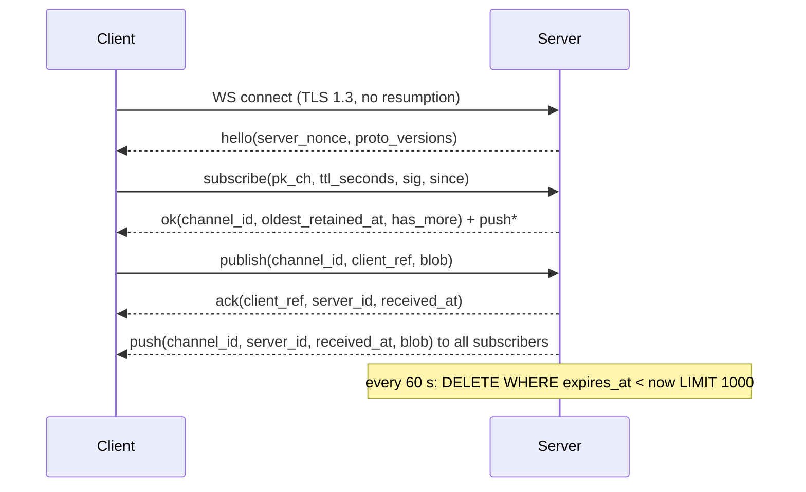
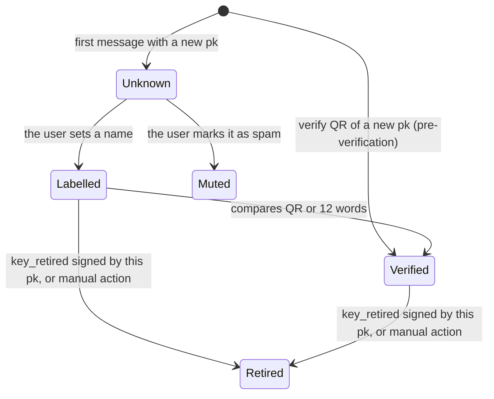
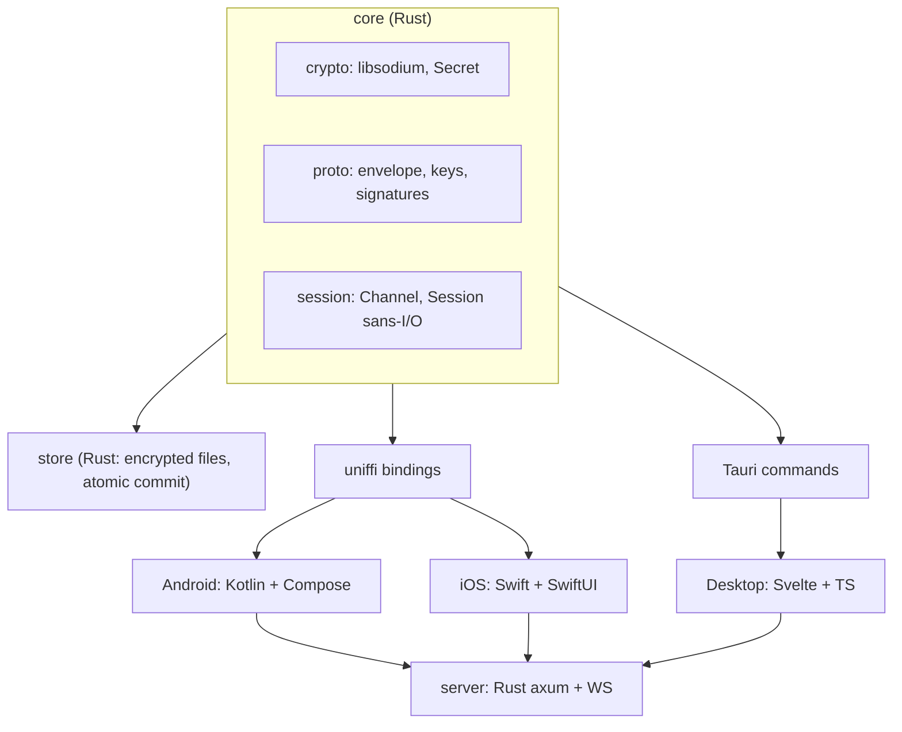
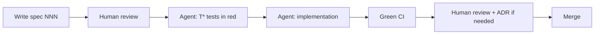

# Private E2E chat — Specification and plan (SDD)

Version: mvp · Updated: 2026-09-21 · Marc Vilardebó · Post-audit D revision (see `docs/audit-log.md`)

This file, on the default branch (`mvp` until the first release), is the canonical source of the specification (see §11 "Governance"). Read copy, may lag behind: https://claude.ai/code/artifact/1527bf13-79e8-485a-908d-a515cbd062a4

## 1. Vision and goals

An end-to-end encrypted group chat where the server is only a mailbox: it has no accounts, knows no identities and cannot read anything. Access to a channel is granted by sharing a config out of band (QR in person, password-encrypted file). Desktop, Android and iOS clients over a single cryptographic core in Rust. Open source: anyone can deploy the server, and each channel lives on the server chosen by whoever created it (ADR 0022). Uncompromising and simple. Every piece that does not bring a demonstrable guarantee is a place to fail, so it is left out.

**What it promises**

- Neither the server nor anyone on the network can decrypt the messages.
- Expired messages are deleted on the server and on the client according to the channel's TTL.
- Every message is authenticated: the receiver knows it comes from the same key it had already labelled.
- No global identity: a user's key is different in every channel.
- The server does not know who writes: it sees opaque blobs per channel, not per member.

**What it does not promise (and must be stated clearly in the documentation)**

- It does not protect against a compromised device or against a member who forwards.
- The confidentiality of the whole channel depends on `K_ch`: whoever has it can decrypt any message of the channel they have captured, past or future, until a new channel is created. v1 has no cryptographic *forward secrecy* or *post-compromise security* (ADR 0013, 0004).
- Messages are authenticated but not deniable.
- The server can delete or delay messages; the client detects this partially (counter gaps) but cannot prevent it.
- Whoever operates, hosts or seizes the server knows from which IP and at what time each person listens, and when you open the app. Without Tor, an IP is a person.
- By default new channels go to the server configured in the app, which at installation is the project's; anyone who does not want that operator to see their metadata can change it in the settings or when creating the channel.
- The app store and the operating system know you have the app installed and when you use it; other apps can detect it.
- On desktop, within the user's session any of their processes can read the data files and the keychain.
- Reinstalling the app, restoring a backup or a hardware failure erases all local data; recovery is re-importing the config.

**Out of scope for v1:** calls, attachments, message quoting, presence indicators, 1-to-1 messages with prekeys, member removal, identity export between devices, federated server, push notifications, hosted web client (ADR 0017), duress code.

## 2. Threat model

The main adversary is the server (or whoever compromises, hosts or seizes it) and any network observer. The user's device and the other members are considered trusted within a channel as far as content is concerned. The following table is reproduced literally in `docs/threat-model.md`; in case of divergence this file prevails and the doc lint (spec 003) checks it.

| Adversary | What it can see or do | How we mitigate it |
| --- | --- | --- |
| Honest-but-curious server | Which `channel_id`s are being listened to, from which IP, when (each connection = the user looks at the app), how many connections and which channels share a device (same connection, or same IP and time), size class (multiples of 1 KiB) and frequency of the blobs, the channel's retention policy, platform by TLS fingerprint | AEAD, padding to 1 KiB buckets, encrypted header (it does not see who writes nor how much, ADR 0018), authentication by channel key (not by user), no accounts, no IP logging, rounded `since`, no TLS resumption, SOCKS5 proxy / Tor / .onion service support |
| Malicious server | In addition: retain blobs beyond the TTL, selectively delete or delay blobs, hide listeners, fill the channel | TTL also on the client, counter gaps visible to the client, open source + reproducible builds, no client with code served by the server (ADR 0017) |
| Seized or coerced operator (preservation or interception order) | Turn on IP↔channel↔time logging from the order onwards | Not mitigable by the protocol: the server does not store IPs on disk by design but can be compelled to. Tor or .onion service; self-hosting |
| Server's hosting or network provider | Netflow: IP↔server↔time of all clients; size of the connected group from the `push` fan-out | Tor or .onion service. Nothing else in v1 |
| User's network observer (ISP, wifi) | Server DNS/SNI, time of each connection, size and direction of each message (1 KiB class; write vs read). Does not see which channel or which member | TLS 1.3, one connection per server (does not reveal the number of channels on it), optional Tor. In v1 `channel_id` is not rotated and no cover traffic is added |
| Member who operates the self-hosted server | Everything the server sees + everything a member sees: label↔IP↔time of each fellow member | Documented: when self-hosting, the operator sees the members' IPs. Tor if that matters |
| Attacker without the config | Create channels and fill the server with blobs | `publish` bound to an authenticated subscription on the same connection; per-connection, per-channel and global quotas; per-IP limits only before authenticating |
| Intruder with the leaked config (also a former member, forever) | Read the whole channel (past and future); write as a new key; create endless keys; fill the channel until the TTL; re-inject old blobs to members who did not see them | Detected if it writes (it appears as unknown); limit on unknown peers with eviction; the per-channel quota protects the server, not the channel: the only answer is a new channel (ADR 0008). Passive reading cannot be prevented |
| Intruder with a member's private key | Impersonate them within that channel; silence them | Key retirement (ADR 0016); alert to the victim when a valid message from their own key is received; key regeneration; new channel |
| Replay of a captured message | Re-inject an old message | Strictly increasing counter per sender (ADR 0019): any counter already seen is rejected; `channel_id` inside the AAD and the signature |
| Physical observer (camera, onlooker, Google Lens) | Capture the invitation QR | Ephemeral on-screen QR with screenshots blocked and "scan only with this app"; alternative file + password spoken aloud; the verification QR is not secret |
| Theft of the locked device | Encrypted local files | `K_db` wrapped in the Keystore / Secure Enclave with the device credential; files closed and key zeroized on lock |
| Physical coercion | Seizure of the unlocked device | Damage limitation only: immediate lock when the screen turns off, device PIN recommended over biometrics. No duress code in v1 |
| Forensic analysis of the device after deletion | Recover old versions of the files (file-system snapshots, copies, flash) | The cryptographic guarantee covers all files (`K_db` in the Keystore/SE); deleting a message inside the log is physical (compaction) and does not resist old copies. Documented |
| Dishonest member | Forward, take screenshots, prove authorship via signatures; know the others' time habits and style | Not mitigable. Documented |

**Outside the model:** malware on the device, rooted or jailbroken device, malicious accessibility services, supply-chain attacks on the app stores, cryptanalysis of the primitives, guaranteed server availability.

## 3. Design decisions (ADR)

Each row corresponds to the file `docs/adr/NNNN-*.md`; titles are copied verbatim from the files. The full index, with status and supersessions, is in `docs/adr/README.md`.

| # | Title | Status | One-line reason |
| --- | --- | --- | --- |
| 0001 | Pre-shared channel key exchanged out of band | accepted | The server must know nothing about the members; no online key agreement is needed |
| 0002 | A single AEAD (XChaCha20-Poly1305) via libsodium | accepted | A cascade adds no security and multiplies errors |
| 0003 | Symmetric hash ratchet over the channel key | superseded by 0013 | It gave no forward secrecy: the root is recomputed from `K_ch` |
| 0004 | No post-compromise security in v1 | accepted | High complexity; compromise = new channel. FS and PCS arrive together in v2 |
| 0005 | Ed25519 signatures per message, with a key per user and per channel | accepted | The only source of origin authenticity: the AEAD alone only proves "someone with the config" |
| 0006 | TOFU: no member list in the config | accepted | An intruder who writes becomes visible; device change without re-editing the config |
| 0007 | Free key regeneration with no link to the old key | accepted | Simplicity and privacy; re-verification is mitigated with UI |
| 0008 | No member removal: a new channel is created | accepted | Consistent with 0001 and 0004 |
| 0009 | TTL defined in the config, enforced by server and client | accepted | The server is not trusted to delete |
| 0010 | Server authentication with a per-channel Ed25519 key pair | accepted | Non-reusable credential, zero state on the server |
| 0011 | Compromise alarm | deprecated | Withdrawn in revision C: plain text + `key_retired` cover it with less surface |
| 0012 | Cryptographic and protocol core in Rust, shared by all clients | accepted | A single auditable implementation |
| 0013 | Message key derived directly from the counter | accepted | Supersedes 0003: O(1), no chain state, no false promise of FS |
| 0014 | TTL bound to the `channel_id` and per-message expiry | accepted | Nobody can change the TTL of an existing channel; the server keeps no channel table |
| 0015 | Fixed-size binary envelope; CBOR only in the encrypted payload | accepted | Unambiguous signed bytes; vectors reproducible by third parties |
| 0016 | Key retirement with a `key_retired` message | accepted | A stolen key cannot remain "Alice ✓" forever |
| 0017 | No hosted web client in v1; native desktop client | accepted | The weakest member sets the guarantees of the whole channel |
| 0018 | Message header encrypted with the channel key | accepted | The server does not see who writes nor how much; one XOR, zero server changes |
| 0019 | One key, one device: strictly increasing counter | accepted | Closes replay against stateless receivers; removes window, bitmap and identity export |
| 0020 | Store and sans-I/O session in the Rust core | accepted | The message + counter + cursor transaction exists once, not three times |
| 0021 | Client without a database: encrypted files with atomic commit | accepted | Zero C outside libsodium; atomicity comes from `rename`; everything fuzzable from Rust |
| 0022 | Exchange server per channel, fixed at creation | accepted | Open source = multiple servers; the group chooses its operator; changing it is a new channel |

## 4. Cryptographic model

Everything comes from libsodium; no primitive of our own is implemented. All literals of this section — parameters, domain tags, KDF contexts — are versioned with `proto_version` and frozen when spec 013 is accepted; changing any requires a new `proto_version` and an ADR. Every multi-byte integer on the wire is big-endian. All times are unix ms in `uint64`; `ttl_ms = u64(ttl_seconds) × 1000` and no formula mixes units.

**Primitives**

| Use | libsodium primitive | Size and conditions |
| --- | --- | --- |
| Message encryption | `crypto_aead_xchacha20poly1305_ietf` | key 32 B, nonce 24 B, tag 16 B |
| Header encryption | `crypto_stream_xchacha20_xor` | key 32 B, nonce 24 B (the same nonce as the envelope) |
| Subkey derivation | `crypto_kdf_derive_from_key` (BLAKE2b) | 32 B; `ctx` of exactly 8 bytes; `subkey_id` = 0 always. The internal encoding of `subkey_id` is libsodium's, not the wire's |
| Keyed hash | `crypto_generichash` (BLAKE2b, key) | `outlen = 32` |
| Unkeyed hash | `crypto_generichash` (BLAKE2b) | `outlen = 32`. `X[0..16]` means "32 B and truncate to the first 16" |
| Message and channel signature | `crypto_sign` (Ed25519) | pk 32 B, sk 64 B, sig 64 B. Verification with libsodium's `crypto_sign_verify_detached` compiled **without** `ED25519_COMPAT`: rejects S ≥ L, small-order `R`, small-order `pk` and non-canonical `pk`. The server verifies exclusively through `core::crypto` |
| Password → key (exported config) | `crypto_pwhash` (Argon2id13) | 32 B; `OPSLIMIT_INTERACTIVE`, `MEMLIMIT_INTERACTIVE` (64 MiB), fixed by `config_version = 1` |
| Encryption of exported files | `crypto_secretbox` | key 32 B, nonce 24 B |
| Fixed-size comparison | `sodium_memcmp` | Every comparison of `[u8; N]` in `core` |
| Randomness | `randombytes_buf` | — |

**Domain tags.** Every hash or signature carries a fixed ASCII prefix that separates its use. They are protocol literals, not the product name:

| Tag | Use |
| --- | --- |
| `privatechat/chid/v1` | `channel_id` |
| `privatechat/auth/v1` | subscription signature to the server |
| `privatechat/msg/v1` | message envelope signature |
| `privatechat/fp/v1` | user fingerprint |

**KDF contexts** (exactly 8 bytes, `subkey_id = 0`): `chauth__`, `msgkey__`, `chhdr___`.

**Keys**

- `K_ch` (32 B, `randombytes_buf`): root key of the channel. Lives only in the config and on the device. Never used directly to encrypt.
- `(pk_ch, sk_ch) = crypto_sign_seed_keypair(KDF(K_ch, "chauth__"))`: Ed25519 key pair **of the channel**, not of any user. All members have it. It proves to the server that one has the config, with a non-reusable credential (ADR 0010).
- `channel_id = BLAKE2b("privatechat/chid/v1" ‖ pk_ch ‖ BE32(ttl_seconds))[0..16]`: public identifier of the channel on the server. Self-certifying (the server recomputes it from `pk_ch` and `ttl_seconds`) and binds the TTL to the channel (ADR 0014).
- `K_msg = KDF(K_ch, "msgkey__")` (32 B): master message key of the channel.
- `K_hdr = KDF(K_ch, "chhdr___")` (32 B): header key of the channel, shared by all members. Hides from the server who writes and how much (ADR 0018).
- `(pk_u, sk_u)`: the user's Ed25519 key pair **per channel**, generated when importing the config. `sk_u` never leaves the device: a key lives on a single device (ADR 0019).

**Message key** (ADR 0013)

```
mk = crypto_generichash(outlen = 32, key = K_msg, in = pk_u ‖ BE64(counter))
```

The message with `counter = c` from sender *u* is encrypted with `mk` and a random 24 B nonce. A single derivation, O(1), stateless; `mk` is erased (`Zeroize`) after encrypting or decrypting. Per-message key and random nonce are independent safeguards: a failure of either alone never repeats a (key, nonce) pair. Whoever has `K_ch` can derive any `mk`: v1 has no forward secrecy (§1, ADR 0004). The payload **is never compressed**, neither in v1 nor in any version: compressing before encrypting leaks content through the size.

**Send counter** (ADR 0019). Starts at 0 and is strictly increasing for each `sk_u`. `Channel::encrypt` reserves `counter`, derives `mk`, seals, and persists `counter + 1` together with the blob in the `outbox` (blobs sealed and not yet `ack`ed, §6) in a single commit before returning the blob (no blob leaves before the commit); if the commit fails, it returns no blob. The UI drains `outbox` in order and notifies each `ack` to the core (`Channel::acked`). `counter = 2^64 − 1` → `Error::CounterExhausted` and the UI forces "Regenerate my key". The maximum number of blobs held in `outbox`, and with it its share of `state.bin`, is fixed by spec 020-store-files.

**Anti-replay** (spec 012; mandatory). For each `pk` seen, the receiver keeps `max_counter: Option<u64>`. `c ≤ max_counter` → `Error::Replay`. `c > max_counter` → accept; after successful decryption, `max_counter = c`. There is no window or bitmap: each `sk_u` lives on a single device and the server delivers each channel in total order (§6). A counter lower than or equal to the maximum seen is always a resend. `Channel::gaps()` reports `c.saturating_sub(max_counter + 1)` per sender as a signal of deletion or delay by the server, with the exceptions of §6 "Cursor and gaps"; a jump greater than 2^32 is shown as "anomalous counter jump: this key may be compromised".

Terminology: *envelope* is the structure, *blob* the bytes on the wire and on the server, *message* the decrypted payload.

**Message envelope on the wire** (ADR 0015, 0018; fixed binary format, no CBOR outside the payload)

| offset | size | field | visible to the server |
| --- | --- | --- | --- |
| 0 | 1 | `proto_version` = 0x01 | yes |
| 1 | 16 | `channel_id` | yes |
| 17 | 40 | `enc_hdr` = (`sender_pk` (32) ‖ `counter` u64 BE (8)) ⊕ `crypto_stream_xchacha20_xor(K_hdr, nonce)` | yes (opaque) |
| 57 | 24 | `nonce` | yes |
| 81 | n | `ciphertext`, n = 16 + 1 024·k, 1 ≤ k ≤ 63 | yes (opaque) |
| 81+n | 64 | `signature` | yes |

- `AAD = blob[0..81]` (includes the encrypted `enc_hdr`, as it travels).
- `signature = crypto_sign_detached(sk_u, "privatechat/msg/v1" ‖ blob[0..81+n])`: *encrypt-then-sign*; the signature covers encrypted header and ciphertext; the receiver verifies it before decrypting. A header decrypted with a wrong `K_hdr` yields a random `pk` and the signature fails.
- Blob size = 161 + 1 024·k: minimum 1 185 B, maximum 64 673 B. `k = (len − 161) / 1024`.

**Plaintext payload** (CBOR, map with integer keys, decoded directly into `struct Payload` with `serde` and `recursion_limit = 8`, never into a generic `Value`; then `sodium_pad` to multiples of 1 024 B; maximum size before padding 64 511 B)

| key | field | type | limits |
| --- | --- | --- | --- |
| 0 | `type` | uint | 0 `text` · 1 `key_retired`. Mandatory |
| 1 | `display_name` | text | ≤ 64 B UTF-8, without characters of the Cc and Cf categories; name suggestion, the receiver decides. Absent in `key_retired` |
| 2 | `sent_at` | uint64 | unix ms **rounded down to the minute**; used only for the delay warning of §6 |
| 3 | `body` | bytes | in `text`: valid UTF-8; in `key_retired`: empty |

- `Payload::validate()` is the only validation function and both `encrypt` and `decrypt` call it. Duplicate key, wrong type, missing `type` or exceeded limit → `Error::BadPayload`.
- After a successful AEAD the anti-replay state **always** advances (authenticated = consumed). An unknown `type` or a padding, CBOR or validation error persists the message as `Unreadable` without a body and the UI shows "unsupported or corrupt message". Unknown CBOR fields are ignored; this way fields can be added in v1.x without changing `proto_version`.
- `key_retired` (ADR 0016): signed with the key being retired. From an unknown `pk` it is consumed and discarded without creating a peer.

**User fingerprint**: `fp = BLAKE2b("privatechat/fp/v1" ‖ channel_id ‖ pk_u)` (32 B). It is presented in three ways:

- **Verification QR**: `verify:v1:` ‖ base64url(`channel_id` ‖ `pk_u`). Carries no name. The receiver recomputes `fp` itself.
- **12 words**: `fp[0..16]` encoded as a standard BIP-39 mnemonic (128 bits + 4 of checksum, English list of 2 048 words). Manual verification only marks "verified" if all 12 match.
- **Short identifier**: the first 4 of the 12 words (44 bits).

**Verification on receive** (in this order; each condition has a single `Error`; any error discards the message without showing it, with no write to the Store (§9) except the cursor of §6):

1. `len < 1185`, `len > 64673` or `(len − 161) mod 1024 ≠ 0` → `BadLength`. `blob[0] ≠ 0x01` → `UnsupportedVersion`. `blob[1..17] ≠ channel_id` → `WrongChannel`.
2. `expires_local < now` (§6) → `Expired`.
3. Decrypt `enc_hdr` with `K_hdr` and `nonce`: `sender_pk`, `counter`.
4. `sender_pk` retired → `RetiredKey`. Unknown with no room (§7 "Peer limits") → `PeerLimit`.
5. `counter ≤ max_counter` → `Replay`.
6. Signature with `sender_pk` → `BadSignature`.
7. Derive `mk`, decrypt the AEAD → `BadSignature` if it fails (cannot happen with a valid signature and a correct `K_ch`; treated the same). `sodium_unpad` → `BadPadding`. CBOR and `validate()` → `BadPayload` (`Unreadable` message, but consumed).
8. Persist the message (or `Unreadable`), `max_counter`, the peer if new and the cursor **in a single commit**; zeroize `mk`.

**Messages from one's own key.** One's own `pk_u` is just another peer with `max_counter` = send counter − 1: the server's echo of one's own message is `Replay` and is discarded. If `decrypt` accepts a message with `sender_pk` = one's own `pk_u` and `counter ≥` send counter: (1) the send counter becomes `counter + 1` (so the victim is not left mute); (2) the `OwnKeyUsedElsewhere` event is persisted (UI in §7 "Key-used-elsewhere alert"). If the message is a `key_retired` of one's own `pk`, the channel becomes read-only until regeneration.

**No-oracle rule.** The core emits no byte to the network depending on the result of `decrypt`; the `Error` codes are local only and no future feature (receipts, "is typing") may expose them to the sender or to the server.

## 5. Channel config and invitation

The config is the only secret of the system. It is a small CBOR document that is shared out of band and that the client keeps in the encrypted local storage (§8).

| key | field | type | description |
| --- | --- | --- | --- |
| 0 | `config_version` | uint8 | 1. Must match the one in the header of the `PCFG` file (format below), otherwise `Error::BadConfig` |
| 1 | `proto_version` | uint8 | version of the message protocol |
| 2 | `K_ch` | bytes32 | root key of the channel |
| 3 | `server_url` | text | `wss://host[:port]`; allows a self-hosted server and `.onion`. Chosen by whoever creates the channel; by default, the `default_server_url` of the app settings. Immutable: changing server = new channel (ADR 0008, 0022) |
| 4 | `ttl_seconds` | uint32 | message expiry (min. 60; max. 2 592 000 = 30 days). Part of the `channel_id` |
| 5 | `created_at` | uint64 | unix ms |
| 6 | `invite_expires_at` | uint64? | unix ms; from then on the client refuses to import it |
| 7 | `suggested_name` | text | ≤ 64 B; proposed channel name; the receiver can change it locally |

**Create channel.** Form with name, TTL and server. The server is prefilled with the `default_server_url` of the app settings and is editable, with the list of servers already used on this device as suggestions; before creating, the client opens a connection and checks that the `hello` replies with the expected `proto_version`. The channel card shows the server, not editable: no basic channel parameter (`K_ch`, TTL, server) (`K_ch`, TTL, server) can be changed once created. "Create new channel" prefills the same name and the same server.

**Two forms of invitation, both with the same content**

| Via | Mechanism | When |
| --- | --- | --- |
| QR in person | CBOR of the config **in the clear**, without a URL scheme: no system camera opens it as a URL. Cameras with cloud recognition (Google Lens) can send the image to third parties: the UI says "scan only with this app". `invite_expires_at` defaults to 10 min, maximum 24 h | Default |
| `.chatcfg` file | Fixed format: `"PCFG"` (4) ‖ `config_version` u8 ‖ `salt` 16 ‖ `nonce` 24 ‖ `crypto_secretbox(cfg_cbor)`. Key = Argon2id13(password, salt) with the parameters of §4; they **do not travel** in the file; unknown version → refusal. Shared via AirDrop, Nearby, email or messaging; the password is spoken over another channel. The `PCFG` prefix identifies the app: the file is considered exposed once sent, which is why it is encrypted | Sharing remotely |

**File password.** Generated by the app: **7 random words** from the BIP-39 list (77 bits), shown so they can be spoken over another channel. The user cannot choose it. The password length is never reduced to compensate for Argon2id parameters, nor the other way round. The `secretbox` tag is a perfect oracle for an offline attacker and `K_ch` does not rotate: the file must resist for years. `core::crypto` bounds no password length (spec 010-primitives-wrapper, R14): the maximum length accepted when opening a `.chatcfg` file is fixed by spec 011-config-format.

**`invite_expires_at` is not a security control.** `K_ch` does not expire. The expiry protects against carelessness (forgotten configs), not against attackers: a modified client ignores it. Whoever suspects a QR has been captured must create a new channel (ADR 0008).

**Client rules on import**

- Refuses configs with a past `invite_expires_at`, unknown `config_version` or `proto_version`, or `ttl_seconds` out of range.
- Derives `channel_id`; if a channel with this id already exists locally, it does not duplicate. If it exists with a different `server_url` → `Error::ConfigMismatch` with a visible error "different config for the same channel": the server is part of the channel and there is no hot migration (members with a different `server_url` would not see each other).
- Generates the `(pk_u, sk_u)` pair for this channel at import time.
- Sends nothing to the server until the user opens the channel.

**Rules on export and display**

- Exporting always asks for confirmation and shows a warning: whoever has this config can read the whole channel, past and future.
- The config QR is shown only after an explicit tap, with screenshots blocked (§8), hides itself after 60 s, and the screen offers neither "save image" nor sharing the image.
- `invite_expires_at` can be set when exporting the file (default 24 h).

## 6. Client-server protocol

The server is a mailbox with TTL: it stores opaque blobs per `channel_id`, distributes them over WebSocket and deletes them. It has no users, validates no content, knows neither `K_ch` nor any other secret, and keeps no channel table. All protocol logic on the client lives in `core::Session` (ADR 0020); the UI only opens the TLS socket and passes bytes.



**Transport.** TLS 1.3 without session resumption (no ticket, no PSK; every connection is a full handshake). The WebSocket handshake carries only `Host`, `Upgrade`, `Connection`, `Sec-WebSocket-Key`, `Sec-WebSocket-Version` and `User-Agent: privatechat/1`, identical on all platforms; no WS extensions (`permessage-deflate` disabled). Maximum frame 70 000 B on client and server. The TLS fingerprint of each platform's stack still reveals the platform; documented.

**Connections.** One connection per **server**, with up to 16 channels subscribed per connection; a device with channels on N servers has N connections, each with its own `Session` (§9). Connections live only while the app is unlocked (§8 "Background"). With a SOCKS5 proxy configured (Tor included), one connection and one circuit per channel, isolated by SOCKS credential (user = 4-byte hex prefix of the `channel_id`, empty password). The server can link channels of the same device by IP and time; only Tor prevents it.

**Protocol messages** (CBOR over binary WebSocket; the core serialises and parses them; maps with text keys)

| Message | Direction | Fields |
| --- | --- | --- |
| `hello` | S→C | `server_nonce` (bytes32), `proto_versions` ([uint], ≤ 8) |
| `subscribe` | C→S | `pk_ch` (bytes32), `ttl_seconds` (uint32), `sig` (bytes64), `since` (uint64 ms, optional; absent = everything) |
| `ok` | S→C | `channel_id` (bytes16), `oldest_retained_at` (uint64 ms), `has_more` (bool) |
| `publish` | C→S | `channel_id`, `client_ref` (bytes16, `randombytes_buf` for each `publish`), `blob` (bytes) |
| `ack` | S→C | `client_ref`, `server_id` (bytes16), `received_at` (uint64 ms) |
| `push` | S→C | `channel_id`, `server_id`, `received_at`, `blob` |
| `error` | S→C | `code` (text), `message` (text, no client data) |

Error codes: `bad_auth`, `nonce_expired`, `bad_ttl`, `not_subscribed`, `bad_blob`, `rate_limited`, `channel_quota`, `server_full`, `unsupported_version`.

**Authentication** (ADR 0010, spec 031). On connect, the server sends a `server_nonce` (32 B, `randombytes_buf`), per connection, valid 60 s from the `hello`. The client replies with `pk_ch`, `ttl_seconds` and

```
sig = crypto_sign_detached(sk_ch, "privatechat/auth/v1" ‖ server_nonce(32) ‖ channel_id(16) ‖ BE32(ttl_seconds) ‖ host)
```

where `host` is `url.host` per WHATWG: lowercase ASCII A-label, no trailing dot, no port, no brackets; IP literals as they appear in `server_url`. The server compares it with the `hostnames` list of its configuration, never with the `Host` header. The server checks the TTL range, recomputes `channel_id` from `(pk_ch, ttl_seconds)`, verifies the signature with `core::crypto` and returns the `channel_id` in `ok`. The credential proves having the config, is not reusable by whoever sees it (server, proxy, logs) and the server stores nothing. After 60 s → `error{nonce_expired}` and a new `hello`. Several `subscribe`s within the window reuse the nonce (each one binds a different `channel_id`).

**Version.** The client refuses to connect if `hello.proto_versions` does not include exactly the `proto_version` of the config; there is no downgrade negotiation. More than 8 elements → local error and disconnection.

**Order and time.** The server assigns `received_at = max(wall_clock_ms, last_received_at + 1)` per process: unique and strictly increasing, so that `ORDER BY received_at` is a total order. Messages are displayed in `received_at` order; the payload's `sent_at` is informative and the client warns if it differs by more than 5 minutes.

**Cursor and gaps.** `server_id` is 16 random bytes (unique, unordered, reveals no volume). The client persists `cursor = received_at` of the last processed `push`, **regardless of the result** (a rejected blob only writes the cursor), in the same commit as any other state of that `push`. On reconnect it sends `since = cursor` **rounded down to the minute**; the resulting duplicates are discarded by `server_id` and by anti-replay. The server returns `ORDER BY received_at` in pages of 500 with `has_more`; `since > now` is treated as `now`; the query filters `expires_at > now`. `oldest_retained_at = now − ttl_ms`; if `since < oldest_retained_at`, the client shows "There may be expired messages before <date>" and `gaps()` does not count the counters before the first message received from each sender in this session.

**Authorisation and envelope validation** (spec 030, 033). The server only accepts `publish` for a `channel_id` authenticated with `subscribe` on the same connection; otherwise `error{not_subscribed}`. Before storing a blob it checks, without touching anything else: `1185 ≤ len ≤ 64673`, `(len − 161)` multiple of 1 024, `blob[0] = 0x01` and `blob[1..17] = channel_id`; otherwise `bad_blob`. It verifies no signatures and decrypts nothing.

**TTL and expiry** (ADR 0014). The TTL is part of the `channel_id` and cannot be changed. Server: `expires_at = received_at + ttl_ms`. Client: `expires_local = min(received_at, now_local) + ttl_ms` according to its own copy of the config, without trusting the server.

**Limits and quotas** (v1 values, configurable on the server):

| Scope | Limit | Response |
| --- | --- | --- |
| Connection | 30 `publish`/min; 16 channels; 1 authentication attempt/s; close on the 3rd failed attempt; no valid `subscribe` within 60 s of the `hello` → close; ping every 30 s, no pong within 30 s → close; send queue ≤ 256 frames or 4 MiB, otherwise close (the client resumes with `since`) | `rate_limited`, close |
| Channel (all connections) | 120 `publish`/min; 4 MiB/min; maximum retention 64 MiB or 20 000 blobs (the new one is rejected, the old one is not deleted). Counters in memory, rebuilt at startup with `GROUP BY channel_id` | `rate_limited`, `channel_quota` |
| IP, **unauthenticated connections only** (before the first valid `subscribe`) | 20 simultaneous; 60 new/min. Not applied to connections from `127.0.0.1` (.onion service). The IP is kept in the clear in memory during the connection and is neither persisted nor logged | close |
| Global | disk quota; `SQLITE_FULL` is never a panic | `server_full` |

The per-channel quota protects the server and the other channels, not the channel: an intruder with the config can fill it in minutes and leave it full until the TTL. The client shows `channel_quota` as "Channel full: probably flooded. Create a new one" (ADR 0008). Anti-spam within a channel is client-side: mute unknowns (§7).

**Storage.** A single table `messages(channel_id, server_id, received_at, expires_at, blob)` with indexes `(channel_id, received_at)` and `(expires_at)`. Plain SQLite (unencrypted: the server only stores opaque blobs; the disk is encrypted at rest) via `rusqlite` with `bundled`, no `sqlx`; WAL mode, `synchronous=NORMAL`, `busy_timeout=5 s`, a single writer: a dedicated thread with a bounded channel (1 024 entries) that groups `INSERT`s into transactions of ≤ 10 ms; queue full → `rate_limited`. Purge: `DELETE … WHERE expires_at < now LIMIT 1000` in a loop every 60 s and at startup, followed by `PRAGMA incremental_vacuum(1000)`; `PRAGMA secure_delete=ON`, `auto_vacuum=INCREMENTAL`. Messages are ephemeral by design: **no backup of `messages`**, no WAL archiving; a crash may lose undelivered messages and this is documented. Any volume snapshot must have a retention ≤ 60 s or not be taken. Postgres is reconsidered with metrics (§12).

**Operation** (spec 035). Server configuration: `hostnames`, `trusted_proxies`, quotas, DB path. `X-Forwarded-For` is only accepted from `trusted_proxies`; otherwise the socket IP. Rejects handshakes with an `Origin` header (no browser client in v1). `deploy/` includes reference configurations for Caddy and nginx (`access_log off`, TLS 1.3 only, no session tickets) and a `torrc` with `HiddenServicePort 443` to publish the service as `.onion`. No SQL statement logging in production. In the logs, no `channel_id`, `server_id` or IP: only aggregate counters and error codes. CI test: none of these values appears in the server output under load.

**What the server can do and know (documented, not mitigated in v1):**

- Metadata: as in §2 row 1, including how many connections and which channels share a device (same connection, or same IP and time). It only sees the channels that live on it.
- Availability: delete, delay or not distribute blobs to some subscribers without cryptographic detection. The client shows `counter` gaps per sender as a signal.
- v2 may add random delay and optional cover traffic (§12).

## 7. Identity and trust UX

Identity is local and per channel: each client keeps `peers` records (`channel_id`, `pk`, `label NULL`, `verified`, `muted`, `retired_at NULL`, `first_seen`, `last_seen`, `max_counter`). Unknown ⇔ `label IS NULL`. The maximum size of `label` in bytes is fixed by spec 026-peer-limits, because together with `outbox` it bounds the size of `state.bin`. The server takes no part in it.



**Presentation rules**

- Unknown: suggested name in grey between quotes, no avatar, with the short identifier (4 words). Messages are shown but with a visible mark. An unknown never shows any other peer's label nor the receiver's name.
- Labelled: local name in black. If two peers of the channel have labels that collide under the normalisation below, both carry the short identifier next to them.
- Verified: name + icon. Lost if the `pk` changes.
- Retired: "Alice (key retired on DD/MM)", in grey. Any message from this `pk` received after the retirement is rejected (`Error::RetiredKey`), whatever its counter. The `(pk, retired_at)` records **are never purged** and count within the limit of 500 (Peer limits, below); their messages do expire.
- **A label already assigned to a `pk` of the channel cannot be assigned to another unverified `pk`.** To reuse it, the new `pk` must be verified (QR or 12 words) or an explicit dialog confirmed that marks the old one as retired. Label and `display_name` comparison is done over `NFKC → casefold → no spaces or format characters → confusables skeleton (UTS #39)`; on rendering, Cc and Cf characters are removed.
- If a new `pk` arrives with a `display_name` that collides with a labelled or verified peer: explicit warning in the chat ("Someone claims to be X with a new key. Verify them before trusting them"). `display_name` and writing style link the old and the new key for the members; this is intended.
- Short identifier (§4): tells peers apart in the UI, is always labelled "identifier, not verification" and never enables the verified state. If the short identifier of a new `pk` matches that of an existing peer, the client shows the 12 words of both with the warning "Identifier identical to another member: possible impersonation. Verify by QR".

**Peer limits** (spec 026). Two counters per channel at the receiver:

- Labelled, verified or retired peers: maximum 500 (hard limit; visible error; no new key is accepted until the user deletes some).
- Unknown peers (muted ones count): maximum 50, with LRU eviction by `last_seen`. Eviction erases that `pk`'s `max_counter`; if it writes again it reappears as a new unknown.
- Nothing is ever ignored silently: the channel card always shows "X new keys ignored" when a limit has been reached.

**Verification.** Screen with one's own `verify:` QR and the 12 words. The screen only accepts `verify:v1:` QRs with the `channel_id` of the open channel; any other is rejected with a message. On scanning: if the `pk` exists → `verified = true` keeping the local label; if it does not exist → the peer is created as verified with the label the user types (**pre-verification**: allows verifying a friend's "new phone" before their first message, which is the real remedy to the impersonation vector). Verification is mutual: each scans the other. No verification goes through the server.

**Key regeneration** (ADR 0007, 0016, 0019). In the channel card, "Regenerate my key". Flow: (1) if `sk_u` is still held, `regenerate_identity` writes a `key_retired` signed with the old key to `outbox` **in the same commit** that erases the old `sk_u` and generates the new one; (2) the UI drains `outbox`; (3) the user reappears as unknown to everyone. Prior warning: "you will appear as unknown again". If the old key has been lost (lost phone), the UI says so: "the others will keep seeing your old key as valid; ask them to mark it as retired", and each peer's card has the action "Mark this key as retired". Changing device = re-importing the config and regenerating (ADR 0019).

**Key-used-elsewhere alert.** If the client receives a valid message from its own `pk` that it did not send (§4), fixed banner "Someone has written with your key in this channel" with the action "Regenerate my key". It is the only key-compromise detector, and it costs nothing.

**Config compromise.** There is no message type for this: whoever suspects the config has leaked writes it in text and the group creates a new channel. The channel card always offers "Create new channel" (same name, new `K_ch`) and, as help text, recommends re-inviting only the verified ones and asking where the leak came from (ADR 0008).

**Leave channel.** (1) Closes the subscription. (2) Locally deletes config (`K_ch`), `sk_u`, `peers` records, `outbox`, messages and cursor. Re-importing the same config is a conscious decision by the user and leaves no local trace.

## 8. Device and client security

The device is where the real attacks land; these measures are mandatory in v1 unless stated otherwise. One mechanism per platform; all state lives in the Rust `Store` (ADR 0020, 0021).

| Measure | Android | iOS | Desktop (Tauri) |
| --- | --- | --- | --- |
| Local storage | No database. Per channel, two files encrypted with `crypto_secretbox` under `K_db`: `state.bin` (small state, rewritten atomically) and `messages.log` (append-only, one record per message). Rust `store` crate (ADR 0021); Kotlin never touches the files | Same; Swift never touches the files | Same |
| App settings | `settings.bin` in the `data_dir`, same format and key `K_db` as `state.bin`: `default_server_url`, `lock_timeout`, SOCKS5 proxy. On first open, `default_server_url` = the compile-time constant `DEFAULT_SERVER_URL` (the project's server; each *fork* puts its own). No other server URL in the code | Same | Same |
| Storage key `K_db` | 32 random bytes wrapped with an AES-GCM key from the Keystore: `setUserAuthenticationParameters(lock_timeout, AUTH_BIOMETRIC_STRONG \| AUTH_DEVICE_CREDENTIAL)`, `setInvalidatedByBiometricEnrollment(false)`, `setUnlockedDeviceRequired(true)`, StrongBox if available | 32 random bytes wrapped with a P-256 key from the Secure Enclave: `SecAccessControl(.privateKeyUsage, .userPresence)`, item `kSecAttrAccessibleWhenUnlockedThisDeviceOnly` | 32 random bytes in the OS keychain (Keychain with code-signature ACL, Credential Manager, Secret Service) |
| Loss of the wrapping key | Backup restore, reinstallation or hardware failure erase all local data; recovery is re-importing the config and regenerating the identity. Documented in §1 and in the help. No transient Keystore failure regenerates the wrapping key | Same | Same |
| App lock | **It is the system prompt** (BiometricPrompt with `DEVICE_CREDENTIAL`) that unwraps the key; no app-specific PIN or password. App `lock_timeout` = Keystore timeout; default 1 min; "strict" option = lock on app switch; quick action "Lock now". The user is recommended a device PIN over biometrics | Same with `LAContext` (`.userPresence`) | App password only if the OS has no keychain; documented |
| Key life cycle | The unwrapped key lives only in Rust (`Secret<32>`) while the app is unlocked in the foreground. It is zeroized, the files are closed and the connection is cut on: lock by timeout, `onStop`, screen off | Same: `sceneDidEnterBackground`, `protectedDataWillBecomeUnavailable`, screen off | Same: OS session lock or timeout |
| Background | None. Locked ⇔ disconnected; on unlock it reconnects with `since`. No in-memory queue | Same | n/a |
| Backup exclusion | `android:allowBackup="false"` **and** `dataExtractionRules` excluding `cloud-backup` and `device-transfer` | `isExcludedFromBackup` on the files; Keychain `ThisDeviceOnly` (excludes iCloud Keychain) | Outside the user's sync directory; Time Machine / File History exclusion documented in `deploy/` |
| Screenshot blocking | `FLAG_SECURE` across the whole app | Blur on `willResignActive`; detect `capturedDidChange` and cover | Not possible; documented |
| Local notifications | Never content nor channel or peer name; fixed text "New messages" | Same | Same; on macOS the Notification Center persists the time |
| Push notifications | None in v1 (§12) | None | None |
| Telemetry | No third-party SDK (crash, analytics, ads). Only the OS crash logs, which the user controls | Same | Same |
| Keyboard | `.chatcfg` password field with `textPassword`, `IME_FLAG_NO_PERSONALIZED_LEARNING` and `flagNoExtractUi`; one-time warning if a third-party keyboard is active | `secureTextEntry`; `autocorrectionType = .no` in the composer | n/a |
| FFI boundary | The password is passed as a `ByteArray` and zeroized on the UI side after the call; the boundary types are listed in §9; outside the core no erasure is promised, **non-retention** is promised (no cache, no log, no `toString`) | Same with `[UInt8]` | Rust to Rust; the Svelte UI strings are copied into a `Uint8Array` and filled with zeros |
| Deletion | Purge of expired messages on open and on unlock = compaction of `messages.log` (rewrite without the expired ones, `rename`). Leaving the channel = deleting the channel directory. The cryptographic guarantee covers all files (`K_db` in the Keystore/SE); deleting a record is physical and does not resist old copies (§2) | Same | Same |
| Clipboard | Copying a message: `ClipDescription.EXTRA_IS_SENSITIVE`; cleared after 60 s. The OS or keyboard clipboard histories are not erased; the config is never copied to the clipboard | `UIPasteboard.setItems(_, options: [.localOnly: true, .expirationDate: +60 s])` (best-effort) | Cleared after 60 s; Win+V may retain it |
| Window and WebView | n/a | n/a | Fixed window title = app name; WebView without cache or persistent storage (temporary `data_directory`) |
| Code integrity | Reproducible builds published with hash; F-Droid or direct APK as an alternative to Google Play | Reproducible builds; published hash | Reproducible builds; published hash and signature |
| Root / jailbreak / accessibility | Not blocked (it would break legitimate users); one-time warning if detected. Production without `debuggable`, without `usesCleartextTraffic`, no `exported` component | One-time warning if jailbreak is detected | Within the session, any process of the user can read keychain and files; documented |

**Logging.** No log with content, names, keys, full `channel_id` or `pk`: only the 4-byte hex prefix when debugging is needed; in production, `warn` level and nothing else. All key material lives in the `Secret<N>` type (no `Clone`, no `Default`, manual `Debug` = `[REDACTED]`, `PartialEq` via `sodium_memcmp`). Test Redacted-`Debug` test (spec 010): `format!("{:?}")` of every type listed in `SECRET_TYPES` is exactly `[REDACTED]`. Test Log test (spec 100, parked until a crate emits): in-memory `tracing` subscriber at TRACE level, full encrypt/decrypt flow with known keys, assert that neither hex nor base64 of `K_ch`, `sk_u`, `sk_ch`, `K_msg`, `K_hdr`, `mk` nor the full `channel_id` appears in it.

## 9. Architecture and technical stack

A Rust core holds all the cryptography, the protocol, the state and the session; the three clients are thin UI layers that open a socket and paint. This way there is only one implementation to audit, and the transaction that keeps message, counter and cursor coherent exists once.



| Component | Technology | Reason |
| --- | --- | --- |
| `core` | Stable Rust pinned in `rust-toolchain.toml` (exact version in spec 000), `libsodium-sys-stable`, `ciborium` + `serde`, `zeroize` | One implementation, controlled memory, no GC leaving keys on the heap |
| `store` | Separate Rust crate: `std::fs` + `core::crypto` (secretbox). Implements the `Store` trait of `core` with two files per channel and atomic commit via `rename` (ADR 0021). No SQLite, no C outside libsodium | Outside `core` because it does I/O (AGENTS 10); a single implementation for the three platforms, fuzzable from Rust |
| Mobile bindings | `uniffi` (proc macros; no UDL). `Config`, `Channel`, `Session` and `Settings` are opaque handles (uniffi `Object`); only `Received`, `Peer`, `Fingerprint`, `Gap` and `Event` are `Record`s. | Generates Kotlin and Swift; secrets do not cross the boundary by value |
| Desktop | Tauri 2 + Svelte 5 + TypeScript; the core is linked in as a Rust crate, no wasm | Pinned and signed code, OS keychain, one more reproducible build |
| Android | Kotlin, Jetpack Compose, minSdk 26. No Room or SQLite: storage belongs to the core | Current standard |
| iOS | Swift 5.10, SwiftUI, iOS 16+. No GRDB or SQLite: storage belongs to the core | Current standard |
| Server | Rust, `axum`, `tokio-tungstenite`, `rusqlite` (plain SQLite, `bundled`, WAL); verifies Ed25519 via `core::crypto` | Performance, a single binary, self-hostable with Docker |
| Protocol tests | JSON test vectors in `specs/vectors/`; the core generates them, Kotlin and Swift validate them through the bindings | Guarantees interoperability |
| CI | GitHub Actions (§10 "CI per phase") | |

**Core boundary** (public API, exposed via uniffi and Tauri commands; the normative signature is in spec 027). Every function that receives external data returns `Result<_, Error>`.

```rust
pub enum Error {
    BadLength, UnsupportedVersion, WrongChannel, Expired, RetiredKey, PeerLimit,
    Replay, BadSignature, BadPadding, BadPayload, CounterExhausted,
    BadConfig, BadPassphrase, InviteExpired, ConfigMismatch, Store(StoreError),
}

pub trait Store {
    fn load(&mut self) -> Result<ChannelState, StoreError>;               // on open; truncates the log to the committed length
    fn commit(&mut self, batch: WriteBatch) -> Result<(), StoreError>;   // single write; atomic (ADR 0021)
    fn compact(&mut self, now: u64) -> Result<u32, StoreError>;          // TTL purge
}

impl Config {
    pub fn create(server_url: &str, ttl_seconds: u32, suggested_name: &str, now: u64) -> Result<Config, Error>;
    pub fn parse(bytes: &[u8], now: u64) -> Result<Config, Error>;              // QR in the clear
    pub fn open_encrypted(bytes: &[u8], passphrase: &[u8], now: u64) -> Result<Config, Error>;
    pub fn export_encrypted(&self, passphrase: &[u8], invite_expires_at: Option<u64>) -> Result<Vec<u8>, Error>;
    pub fn channel_id(&self) -> [u8; 16];
}

impl Channel {
    pub fn open(config: Config, store: Box<dyn Store>) -> Result<Channel, Error>;
    pub fn encrypt(&mut self, payload: &Payload, now: u64) -> Result<(ClientRef, Vec<u8>), Error>; // reserves counter + outbox
    pub fn decrypt(&mut self, blob: &[u8], received_at: u64, now: u64) -> Result<Received, Error>;
    pub fn acked(&mut self, client_ref: ClientRef, server_id: [u8; 16], received_at: u64) -> Result<(), Error>;
    pub fn outbox(&self) -> Result<Vec<(ClientRef, Vec<u8>)>, Error>;
    pub fn cursor(&self) -> Result<Option<u64>, Error>;
    pub fn peers(&self) -> Result<Vec<Peer>, Error>;
    pub fn label(&mut self, peer: PeerId, name: &str) -> Result<(), Error>;
    pub fn verify(&mut self, peer: PeerId) -> Result<(), Error>;
    pub fn mute(&mut self, peer: PeerId, muted: bool) -> Result<(), Error>;
    pub fn retire(&mut self, peer: PeerId, now: u64) -> Result<(), Error>;
    pub fn regenerate_identity(&mut self, now: u64) -> Result<(), Error>;      // key_retired to outbox if sk_u was held
    pub fn fingerprint(&self, peer: PeerId) -> Result<Fingerprint, Error>;      // { words: [String; 12], qr: Vec<u8> }
    pub fn purge_expired(&mut self, now: u64) -> Result<u32, Error>;
    pub fn auth_subscribe(&self, server_nonce: &[u8; 32], host: &str) -> Result<AuthProof, Error>;
    pub fn gaps(&self) -> Vec<Gap>;
    pub fn leave(self) -> Result<(), Error>;
}

impl Settings {                                                                 // settings.bin (ADR 0021)
    pub fn load(store: &dyn Store) -> Result<Settings, Error>;                  // first open: DEFAULT_SERVER_URL
    pub fn save(&self, store: &mut dyn Store) -> Result<(), Error>;
}

impl Session {                                                                  // sans-I/O, ADR 0020; one per server
    pub fn new(host: &str, channels: Vec<Channel>) -> Session;                   // all channels with this host
    pub fn on_connect(&mut self, now: u64);
    pub fn on_frame(&mut self, frame: &[u8], now: u64) -> Result<Vec<Event>, Error>; // hello/ok/push/ack/error
    pub fn outgoing(&mut self) -> Vec<Vec<u8>>;                                 // subscribe, publish
}
```

- The UI never touches a key. The core never touches the network or the UI: it receives bytes and returns bytes. The UI groups the `Channel`s by `host`, opens one TLS socket per group, passes frames in both directions and reconnects with backoff when it receives `Event::Reconnect`.
- No server URL in the code outside the `DEFAULT_SERVER_URL` constant (spec 000).
- The core does no I/O and does not read the clock: no `std::net`, `std::fs`, `tokio`, `SystemTime::now`. Time enters as a parameter (`now`). Checked with `cargo deny` (bans) and clippy `disallowed_methods`.
- One data directory per device with a `LOCK` file (advisory), one process: no widget or share extension in v1.
- `Channel` has no state that has not gone through `commit`: in memory there is the copy loaded at `open`, and every change is written before returning the result.

## 10. SDD execution plan

Seven phases; each one closes when its specifications have green tests and a human review. Phases 1 and 2 are the heart and no UI is started until they are closed.

| Phase | Feature specs (`specs/NNN-*.md`) | Exit criterion |
| --- | --- | --- |
| 0. Foundation | 000-repo-layout, 001-ci, 002-adr-log, 003-doc-lint | Monorepo with the files of §11, green CI, ADRs 0001–0022 with index, green doc lint, `DEFAULT_SERVER_URL` constant defined, this document in `docs/` |
| 1. Crypto core | 010-primitives-wrapper, 011-config-format, 012-message-keys (derivation, encrypted header, monotonic anti-replay), 013-wire-message, 014-fingerprint, 015-test-vectors, 016-fuzz-harness | `cargo test` 100 % over vectors, including the mutation table of 013; fuzzing of `decrypt`, of the payload parser and of the config parser for 1 h without a crash; internal review of `proto` by a second person |
| 2. Session and storage | 020-store-files, 021-channel-session, 022-peers-tofu, 023-ttl-purge, 024-key-retired, 025-identity-regen, 026-peer-limits, 027-core-api, 028-session-sans-io | Two cores with a real `store` on disk exchange 10 000 messages with 1 % duplicates, `FailingStore` at a random commit *n* and a test that kills the process between the append to the log and the write of `state.bin`: 0 errors, 100 % of duplicates rejected, coherent state on reopening; compaction verified |
| 3. Server | 030-ws-protocol, 031-auth-channel-signature, 032-storage-ttl, 033-rate-limit-quotas, 034-docker, 035-server-ops | Core↔server integration test via `Session`; working `docker compose up`; `deploy/README.md` "Deploy your own server"; log test without identifiers |
| 4. Bindings | 040-uniffi, 041-desktop-bridge | Kotlin and Swift pass the same vectors as Rust; the empty Tauri app opens a channel |
| 5. Clients | 050-desktop-mvp, 051-android-mvp, 052-ios-mvp, 053-device-security, 054-qr-invite, 055-verify-ui | One user on each platform chats in the same channel; all measures of §8 applied; store publication process started |
| 6. Hardening | 060-reproducible-builds, 061-threat-review, 062-security-docs, 063-beta, 100-log-test | Published hashes; external review of the cryptographic and threat model; public documentation of what it promises and does not promise; no spec left in `draft` |

**Template for each spec**: `specs/TEMPLATE.md`. **Index**: `specs/README.md`, checked by the doc lint.

**CI per phase**

- Phase 0: `cargo fmt --all --check`, `cargo clippy --all-targets --all-features -- -D warnings` (workspace lints), `cargo test`, `cargo deny --all-features check` (advisories, licenses, bans, sources), `scripts/doc_lint.sh`, `scripts/check_requirements.sh`, `adr-guard` (a diff that touches `crates/core/src/proto/**`, `crates/core/src/crypto/**`, `specs/vectors/**` or specs 011–013 without adding a file to `docs/adr/` fails, unless the `adr-not-needed` label is set by a human), `commit-lint`.
- Phase 1: nightly fuzz (`cargo fuzz`, 1 h per target: `decrypt`, `payload_parse`, `config_parse`, `encrypt_then_decrypt`), property tests (`proptest`: round-trip for all k, byte-by-byte mutation), log test, redacted `Debug` test.
- Phase 3: integration test with the server in Docker; Kotlin/Swift vs Rust differential test over vectors from phase 4 onwards.
- Phase 5: basic UI tests per platform.
- Phase 6: reproducible build and hash comparison.

**Recommended order for the first 6 weeks**

1. Week 1: phase 0 complete; specs 010–016 written and reviewed (still no code).
2. Weeks 2–3: implement 010–016; generate vectors; fuzzing.
3. Week 4: specs and implementation 020–028.
4. Week 5: server 030–035 and integration test.
5. Week 6: bindings 040–041. The desktop MVP (050) starts when phase 4 is closed.

From then on the three clients advance in parallel over a core whose API no longer changes.

**Definition of done, for the whole project** (the PR template renders these items as checkboxes, in this order)

- [ ] Every R\* has a T\* (`scripts/check_requirements.sh` green)
- [ ] The local CI commands of `.github/CONTRIBUTING.md` green (fmt, clippy, build, test, deny, doc lint, requirements)
- [ ] Workspace lints (`[workspace.lints]` in `Cargo.toml`) at `deny` in `core`, `store` and `server`; `overflow-checks = true` in release
- [ ] No secret in logs; redacted `Debug` on every new secret type (added to `SECRET_TYPES`)
- [ ] Every rejection path has a test `input → Error::X · commits = 0`; stateful spec → test with `FailingStore`
- [ ] New dependencies justified in the PR, one sentence each
- [ ] Format, config, derivation or tag change → new ADR in `docs/adr/`
- [ ] No accepted ADR modified outside its status line
- [ ] `docs/spec.md` up to date (`Updated` header) and a row in `docs/audit-log.md` if a decision changes
- [ ] ≤ 400 lines of net diff; a single spec; PR title `NNN: …`
- [ ] The `architecture` skill and the language skill followed
- [ ] Everything in English (AGENTS 11)

## 11. Repository and working with agents

Monorepo with the specs as the source of truth; agents implement against the spec, not against the conversation.

```
/
├─ AGENTS.md                 ← rules for the agents
├─ CLAUDE.md                 ← "Read and follow AGENTS.md"
├─ .claude/skills/           ← code standard: architecture, rust, kotlin, swift, typescript-svelte
├─ README.md                 ← what it promises and does not promise (§1), how to contribute
├─ LICENSE
├─ Cargo.toml                ← workspace with [workspace.lints]
├─ rust-toolchain.toml · rustfmt.toml · deny.toml · .editorconfig · .gitignore
├─ .github/
│  ├─ workflows/ci.yml
│  ├─ PULL_REQUEST_TEMPLATE.md · dependabot.yml
│  └─ CONTRIBUTING.md · SECURITY.md · CODEOWNERS
├─ docs/
│  ├─ spec.md                ← this document (canonical)
│  ├─ threat-model.md
│  ├─ audit-log.md           ← findings and changes of every audit (§13 points here)
│  ├─ assistant.example.md   ← template for personal AI-assistant preferences (copied to git-ignored assistant.md)
│  └─ adr/README.md · TEMPLATE.md · 0001-…md … 0022-…md
├─ specs/                    ← one spec per feature (TEMPLATE.md, README.md index)
│  └─ vectors/               ← JSON test vectors, generated by the core (README.md with the schema)
├─ scripts/{doc_lint,check_requirements}.{sh,py}
├─ crates/
│  ├─ core/                  ← Rust crate: crypto, proto, session (no I/O); fuzz/ in phase 1
│  ├─ store/                 ← Rust crate: Store trait over encrypted files (phase 2)
│  └─ server/                ← Rust axum crate (phase 3)
├─ bindings/uniffi/          (phase 4)
├─ clients/desktop · android · ios   (phase 5)
└─ deploy/                   ← reference docker-compose.yml, Caddyfile, nginx.conf, torrc (phase 3)
```

**Governance of the specification.** Since the creation of the repository, `docs/spec.md` on the default branch (`mvp` until the first release) is the only canonical version. Claude's living document is a read copy that may lag behind; nothing is edited there. Every change to `docs/spec.md` is made by PR with human review; if it changes a decision of §3–§6, the PR includes a new ADR and a row in `docs/audit-log.md`. The `Version · Updated` header is brought up to date on every change and the doc lint checks it.

**Source precedence** (also in `AGENTS.md`): 1) the accepted spec `specs/NNN-*.md` for its feature; 2) `docs/spec.md`; 3) the ADRs (historical context). If a spec contradicts `docs/spec.md`, the agent stops and opens an open question; it does not decide.

**Per-feature flow**



Human review at B and F is mandatory in `core`, `store` and `server`; in the clients it may be only F.

## 12. Open decisions and risks

None of the open decisions blocks phases 0–2. Those that would change the wire format were closed in revision C; any reopening is `proto_version = 2`.

**Decisions closed in revisions B and C** — they can be reopened with an ADR. Decisions with an ADR are in §3; the following were closed without one:

- Fingerprint word list: English BIP-39 (compatibility with libraries and checksum).
- KDF contexts and domain tags: protocol literals, independent of the product name.
- Duress code: out of v1.
- Server: SQLite only in v1 (plain, via `rusqlite`).
- No `presence`, `compromise_alert`, `reply_to` or `join` link in v1; no connection-sharing option; no app-specific PIN.
- 7-word file password with Argon2id INTERACTIVE.
- Licence: MIT for the whole repository.
- UI languages: English (source and default), Spanish, French, Catalan and Italian, in the three clients. Strings live in the platform resource files, never inline; the core never produces user-facing text.

**Open decisions**

- [ ] Product name. Affects only the repo name, the stores and the documentation; affects no protocol literal.
- [ ] List of known community servers: in the documentation, not inside the app.
- [ ] v1.x without a `proto_version` change (new CBOR key in the payload; old receivers ignore it): message quoting (`reply_to` = hash of the quoted blob), presence indicator.
- [ ] Web client (v2): browser extension with pinned code, or web hosted on an origin and by an operator different from the message server's.
- [ ] Push notifications (v2): one token per device registered on the connection; the server stores `token → {channel_id}` (the same it already sees through the connection); the tap carries no data and is sent at most once per device every 5 min. Google-free alternative: UnifiedPush. Server-free alternative: periodic OS sync.
- [ ] Attachments (v2): separate blob store with the key inside the message.
- [ ] Epoch jump (v2): ephemeral X25519 signed per member; new `K_ch` every N messages or days derived from the DHs between active members. Gives FS and PCS at once. Conditions `proto_version 2`.
- [ ] Random delay and cover traffic as a per-channel option (v2). Tor-first (v2): in v1 the system is Tor-compatible, it does not depend on it.
- [ ] Split invitation for environments with cameras: QR with 16 B + dictated words (v2).
- [ ] Local per-channel key (derived from `K_db` and a per-channel salt kept in the Keystore) to do cryptographic erasure at channel level instead of physical (v2).
- [ ] Postgres for the public service once there are metrics.

**Risks**

| Risk | Impact | Mitigation |
| --- | --- | --- |
| Our own error in the format or in the key derivation | Breaks confidentiality without anyone noticing | Fixed binary format, positive and negative vectors, mutation table, fuzzing, external review before the beta |
| State error (counter, cursor, anti-replay) spread across layers | Messages silently rejected or replay accepted | A single `Store` in Rust with `commit(Batch)`; `FailingStore` in CI; "counter before blob" rule (§4) |
| Users who share the config by photo or messaging | The whole model falls | UX that pushes towards the in-person QR, warnings on export, ephemeral QR, generated 7-word password |
| TOFU confusion: accepting an impostor as a "new phone" | Impersonation | Labels not reusable without verifying, pre-verification by QR, key retirement, short identifier marked as non-verification and collision rule |
| App stores reject reproducible builds or demand SDKs that break the model | Delay | Start the publication process in phase 5; F-Droid as an alternative |
| Complexity of maintaining three clients | Divergence | Common core with sans-I/O `Session`; no protocol logic in the UI |
| Without push, users do not find out about messages | Adoption | Document it as a privacy choice; solve it in v2 |

## 13. Audit log

Audits A (2026-09-19), B, C and D (2026-09-20): findings and applied changes are in `docs/audit-log.md`. Every PR that changes §3–§6 adds a row there.
